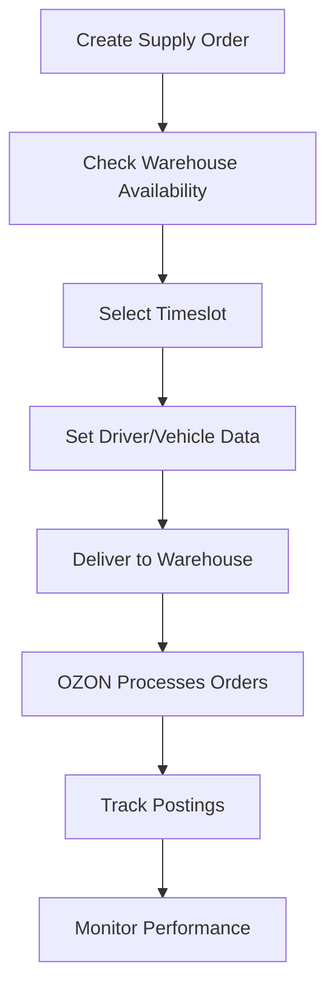

# 16. FBO API

**FBO API** - Fulfillment by OZON comprehensive management and operations for OZON Seller API.

## Overview

The FBO (Fulfillment by OZON) API provides complete management of warehouse operations where OZON handles storage, packaging, and shipping. This comprehensive API covers supply orders, posting management, warehouse availability, and logistics coordination across 13 specialized methods.

### Key Features
- **Supply Order Management**: Create, track, and manage warehouse deliveries
- **Posting Operations**: Complete FBO posting lifecycle management
- **Warehouse Integration**: Real-time availability and capacity monitoring
- **Logistics Coordination**: Driver data, vehicle info, and timeslot management

---

## 📋 Methods Overview

Due to the comprehensive nature of this API (13 methods), documentation is split into specialized sections:

### 📦 Core Supply Operations
1. **[Supply Order Management →](./16-fbo-supply.md)** (6 methods)
   - getSupplyOrdersList, getSupplyOrder
   - getSupplyOrderBundle, getSupplyOrderStatusCounter
   - createSupplyOrderPass, getSupplyOrderPassStatus

2. **[Timeslot & Logistics →](./16-fbo-timeslot.md)** (3 methods)
   - getSupplyOrderTimeslots, getSupplyOrderTimeslotStatus
   - updateSupplyOrderTimeslot

### 🏢 Warehouse & Operations
3. **[Warehouse & Posting Management →](./16-fbo-operations.md)** (4 methods)
   - getWarehouseAvailability, getCancelReasons
   - getPosting, getPostingsList

---

## 🚀 Quick Start Example

```typescript
import { OzonSellerAPI } from 'daytona-ozon-seller-api';

const api = new OzonSellerAPI({
  clientId: 'your-client-id',
  apiKey: 'your-api-key'
});

// Complete FBO workflow example
async function fboWorkflowExample() {
  // 1. Check warehouse availability
  const warehouses = await api.fbo.getWarehouseAvailability();
  console.log('Available warehouses:', warehouses.warehouses?.length);

  // 2. Get supply orders
  const orders = await api.fbo.getSupplyOrdersList({
    since: '2024-01-01T00:00:00Z',
    to: '2024-01-31T23:59:59Z',
    filter: { status: ['created', 'confirmed'] },
    limit: 50
  });
  
  // 3. Process each order
  for (const order of orders.supply_orders || []) {
    // Get order details
    const orderDetails = await api.fbo.getSupplyOrder({
      supply_order_id: order.supply_order_id
    });
    
    // Get available timeslots
    const timeslots = await api.fbo.getSupplyOrderTimeslots({
      warehouse_id: order.warehouse_id,
      date_from: '2024-01-15T00:00:00Z',
      date_to: '2024-01-22T00:00:00Z'
    });
    
    // Update timeslot if needed
    if (timeslots.timeslots?.length > 0) {
      await api.fbo.updateSupplyOrderTimeslot({
        supply_order_id: order.supply_order_id,
        timeslot_id: timeslots.timeslots[0].timeslot_id
      });
    }
  }

  // 4. Get postings information
  const postings = await api.fbo.getPostingsList({
    since: '2024-01-01T00:00:00Z',
    to: '2024-01-31T23:59:59Z',
    filter: { status: ['shipped', 'delivered'] },
    with: { analytics_data: true, financial_data: true },
    limit: 100
  });
  
  console.log(`Processed ${postings.total} FBO postings`);
}
```

---

## 🔄 FBO Business Flow

### Standard FBO Workflow


### Integration Points
1. **Inventory Management** → Supply order creation
2. **Logistics Planning** → Timeslot coordination
3. **Warehouse Operations** → Delivery coordination
4. **Order Fulfillment** → OZON processing
5. **Performance Analytics** → Business intelligence

---

## 📊 Core Data Models

### Supply Order Structure
```typescript
interface FboSupplyOrder {
  supply_order_id: number;
  status: 'created' | 'confirmed' | 'shipped' | 'delivered' | 'cancelled';
  warehouse_id: number;
  planned_delivery_date: string;
  total_products: number;
  total_amount: number;
  created_at: string;
  updated_at: string;
}
```

### Posting Structure
```typescript
interface FboPosting {
  posting_number: string;
  status: 'awaiting_deliver' | 'delivered' | 'cancelled';
  warehouse_id: number;
  products: FboPostingProduct[];
  analytics_data?: FboAnalyticsData;
  financial_data?: FboFinancialData;
  created_at: string;
  delivered_at?: string;
}
```

### Warehouse Availability
```typescript
interface FboWarehouse {
  warehouse_id: number;
  name: string;
  location: string;
  capacity_utilization: number; // 0-100%
  is_accepting_supply: boolean;
  working_hours: {
    start_time: string;
    end_time: string;
    days: string[];
  };
}
```

---

## 🎯 Key Benefits

### For Sellers
- **Hands-off Fulfillment**: OZON handles storage, picking, packing, shipping
- **Scalable Operations**: Leverage OZON's warehouse network
- **Reduced Complexity**: No direct shipping or customer service
- **Prime Integration**: Access to OZON Prime delivery benefits

### For Operations
- **Centralized Management**: Single API for all FBO operations
- **Real-time Visibility**: Track orders and postings in real-time
- **Automated Processes**: Reduce manual intervention
- **Performance Analytics**: Comprehensive reporting and insights

---

## ⚠️ Important Considerations

### Business Rules
- **Warehouse Scheduling**: Timeslots must be booked in advance
- **Driver Documentation**: Complete driver/vehicle data required
- **Quality Standards**: Products must meet OZON quality requirements
- **Return Handling**: OZON manages returns and customer service

### Technical Requirements
- **API Rate Limits**: Respect API throttling limits
- **Data Validation**: Ensure all required fields are provided
- **Error Handling**: Implement robust error recovery
- **Monitoring**: Track API performance and success rates

### Cost Implications
- **Storage Fees**: Based on volume and duration
- **Fulfillment Costs**: Per-order handling fees
- **Return Processing**: Costs for return handling
- **Premium Services**: Additional fees for expedited processing

---

## 📖 Detailed Documentation

### Comprehensive Method Coverage

Each specialized section provides:
- **Complete TypeScript interfaces** for all requests/responses
- **Practical code examples** with real-world scenarios
- **Business workflow patterns** and best practices
- **Error handling strategies** and recovery patterns
- **Performance optimization techniques**

### Documentation Sections

1. **[16-fbo-supply.md](./16-fbo-supply.md)** - Supply Order Management
   - Supply order lifecycle management
   - Bundle composition and tracking
   - Driver and vehicle data management
   - Status monitoring and reporting

2. **[16-fbo-timeslot.md](./16-fbo-timeslot.md)** - Timeslot & Logistics
   - Warehouse timeslot availability
   - Delivery scheduling and updates
   - Logistics coordination patterns

3. **[16-fbo-operations.md](./16-fbo-operations.md)** - Warehouse & Operations
   - Warehouse capacity monitoring
   - Posting management and tracking
   - Cancellation reason handling

---

## 🔗 Related Documentation

- **[FBS API (07-fbs.md)](./07-fbs.md)** - Seller-fulfilled operations
- **[Report API (report.md)](./report.md)** - Analytics and performance reporting
- **[Product API (product.md)](./product.md)** - Product catalog management

---

**Implementation Status**: ✅ Complete  
**Last Updated**: 2024  
**API Version**: v1/v2  
**Methods Count**: 13 methods across 3 specialized sections