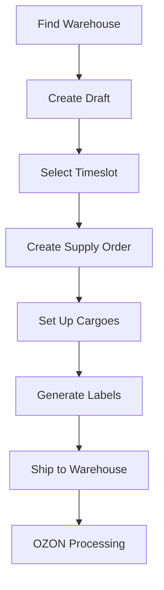

# 17. FBO Supply Request API

**FBO Supply Request API** - Comprehensive FBO supply order management and logistics coordination for OZON Seller API.

## Overview

The FBO Supply Request API provides complete management of supply order requests from draft creation to final delivery. This comprehensive API covers draft management, cargo handling, label generation, warehouse coordination, and supply order lifecycle management across 18 specialized methods.

### Key Features
- **Draft Management**: Create and manage supply order drafts
- **Cargo Operations**: Handle cargo creation, labeling, and management
- **Warehouse Coordination**: Find optimal warehouses and manage timeslots
- **Supply Order Lifecycle**: Complete order management from creation to completion
- **Label Generation**: Automated cargo label creation and PDF export

---

## 📋 Methods Overview

Due to the comprehensive nature of this API (18 methods), documentation is split into specialized sections:

### 📝 Core Draft & Order Operations
1. **[Draft & Order Management →](./17-fbo-supply-request-drafts.md)** (6 methods)
   - createDraft, getDraftInfo, getTimeslotInfo
   - createSupplyOrderFromDraft, getSupplyOrderCreateStatus
   - cancelSupplyOrder, getSupplyOrderCancelStatus, updateSupplyOrderContent

### 📦 Cargo & Logistics Operations  
2. **[Cargo & Label Management →](./17-fbo-supply-request-cargo.md)** (8 methods)
   - createCargoes, getCargoesCreateInfo, deleteCargoes, getCargoesDeleteStatus
   - createCargoLabels, getCargoLabels, getCargoLabelsFile
   - getCargoRules

### 🏢 Warehouse & Infrastructure
3. **[Warehouse & Cluster Management →](./17-fbo-supply-request-warehouse.md)** (4 methods)
   - getClusterList, getWarehouseFboList
   - Warehouse selection optimization and cluster analysis

---

## 🚀 Quick Start Example

```typescript
import { OzonSellerAPI } from 'daytona-ozon-seller-api';

const api = new OzonSellerAPI({
  clientId: 'your-client-id',
  apiKey: 'your-api-key'
});

// Complete FBO Supply Request workflow
async function completeSupplyRequestWorkflow() {
  // 1. Find optimal warehouse
  const warehouses = await api.fboSupplyRequest.getWarehouseFboList({
    region: 'Москва',
    warehouse_type: 'DIRECT'
  });
  
  const warehouse = warehouses.warehouses?.[0];
  if (!warehouse?.is_available) {
    throw new Error('No available warehouses found');
  }

  // 2. Create draft supply order
  const draft = await api.fboSupplyRequest.createDraft({
    supply_type: 'DIRECT',
    warehouse_id: warehouse.warehouse_id,
    items: [
      { sku: '123456789', quantity: 10 },
      { sku: '987654321', quantity: 5 },
      { sku: '555666777', quantity: 20 }
    ]
  });

  console.log(`Draft created: ${draft.draft?.draft_id}`);

  // 3. Get available timeslots
  const timeslots = await api.fboSupplyRequest.getTimeslotInfo({
    warehouse_id: warehouse.warehouse_id,
    date_from: '2024-01-15',
    date_to: '2024-01-22'
  });

  const availableSlot = timeslots.timeslots?.find(slot => slot.is_available);
  if (!availableSlot) {
    throw new Error('No available timeslots found');
  }

  // 4. Create supply order from draft
  const createOrderTask = await api.fboSupplyRequest.createSupplyOrderFromDraft({
    draft_id: draft.draft?.draft_id,
    timeslot_id: availableSlot.timeslot_id
  });

  console.log(`Supply order creation started: ${createOrderTask.task_id}`);

  // 5. Wait for order creation
  let orderCreated = false;
  let supplyOrderId: number | undefined;
  
  while (!orderCreated) {
    await new Promise(resolve => setTimeout(resolve, 5000)); // Wait 5 seconds
    
    const status = await api.fboSupplyRequest.getSupplyOrderCreateStatus({
      task_id: createOrderTask.task_id
    });
    
    if (status.status === 'completed') {
      supplyOrderId = status.supply_order_id;
      orderCreated = true;
      console.log(`Supply order created: ${supplyOrderId}`);
    } else if (status.status === 'error') {
      throw new Error(`Order creation failed: ${status.error_message}`);
    }
  }

  // 6. Set up cargoes
  const cargoTask = await api.fboSupplyRequest.createCargoes({
    supply_order_id: supplyOrderId!,
    cargoes: [
      {
        cargo_number: 'CARGO001',
        weight: 25.5,
        length: 40, width: 30, height: 20,
        items: [
          { sku: '123456789', quantity: 5 },
          { sku: '987654321', quantity: 3 }
        ]
      },
      {
        cargo_number: 'CARGO002',
        weight: 18.0,
        length: 35, width: 25, height: 15,
        items: [
          { sku: '555666777', quantity: 10 }
        ]
      }
    ]
  });

  console.log(`Cargo setup started: ${cargoTask.task_id}`);

  // 7. Generate cargo labels
  const labelTask = await api.fboSupplyRequest.createCargoLabels({
    supply_order_id: supplyOrderId!,
    cargo_ids: [1001, 1002] // These would come from cargo creation result
  });

  console.log(`Label generation started: ${labelTask.task_id}`);

  return {
    draftId: draft.draft?.draft_id,
    supplyOrderId,
    warehouseName: warehouse.name,
    timeslotId: availableSlot.timeslot_id
  };
}
```

---

## 🔄 FBO Supply Request Business Flow

### Standard Supply Request Workflow


### Integration Points
1. **Warehouse Selection** → Capacity and availability checking
2. **Draft Creation** → Product catalog validation
3. **Timeslot Management** → Logistics coordination
4. **Cargo Management** → Physical logistics planning
5. **Label Generation** → Shipping documentation
6. **Order Tracking** → Status monitoring and updates

---

## 📊 Core Data Models

### Supply Draft Structure
```typescript
interface FboSupplyDraft {
  draft_id: string;
  supply_type: 'DIRECT' | 'CROSS_DOCK';
  warehouse_id: number;
  warehouse: {
    name: string;
    address: string;
    type: string;
  };
  items: Array<{
    sku: string;
    name: string;
    quantity: number;
    dimensions: ProductDimensions;
  }>;
  status: 'created' | 'validated' | 'ready';
  created_at: string;
}
```

### Cargo Structure
```typescript
interface FboCargo {
  cargo_id: number;
  cargo_number: string;
  weight: number;
  dimensions: {
    length: number;
    width: number;  
    height: number;
  };
  items: Array<{
    sku: string;
    quantity: number;
    product_name: string;
  }>;
  status: 'created' | 'labeled' | 'shipped' | 'delivered';
}
```

### Warehouse Structure
```typescript
interface FboWarehouse {
  warehouse_id: number;
  name: string;
  type: 'DIRECT' | 'CROSS_DOCK';
  address: string;
  region: string;
  is_available: boolean;
  capacity_info: {
    max_pallets: number;
    available_pallets: number;
    utilization_rate: number;
  };
  working_hours: WorkingHours;
  contact_info: ContactInfo;
}
```

---

## 🎯 Key Benefits

### For Logistics Operations
- **End-to-End Management**: Complete supply request lifecycle
- **Automated Processing**: Reduced manual intervention
- **Real-time Tracking**: Full visibility into operations
- **Flexible Cargo Handling**: Adaptable to different cargo types

### For Business Operations
- **Warehouse Optimization**: Intelligent warehouse selection
- **Cost Management**: Optimized logistics and timing
- **Scalable Operations**: Handle high-volume supply requests
- **Quality Control**: Comprehensive validation and error handling

---

## ⚠️ Important Considerations

### Business Rules
- **Supply Types**: DIRECT vs CROSS_DOCK have different requirements
- **Cargo Limits**: Weight and dimension restrictions apply
- **Timeslot Booking**: Advanced booking required for optimal slots
- **Label Requirements**: All cargoes must have proper labels

### Technical Requirements
- **Asynchronous Operations**: Many operations are task-based
- **Status Polling**: Regular status checking required
- **Error Handling**: Comprehensive error recovery needed
- **File Management**: PDF label handling and storage

### Cost Implications
- **Warehouse Fees**: Based on storage duration and volume
- **Timeslot Costs**: Peak hour premiums may apply
- **Label Generation**: Costs for label printing and materials
- **Cargo Handling**: Fees based on cargo complexity

---

## 📖 Detailed Documentation

### Comprehensive Method Coverage

Each specialized section provides:
- **Complete TypeScript interfaces** for all requests/responses
- **Practical code examples** with real-world scenarios  
- **Business workflow patterns** and best practices
- **Error handling strategies** and recovery patterns
- **Performance optimization techniques**

### Documentation Sections

1. **[17-fbo-supply-request-drafts.md](./17-fbo-supply-request-drafts.md)** - Draft & Order Management
   - Draft creation and validation
   - Supply order lifecycle management
   - Timeslot coordination and booking
   - Order cancellation and content updates

2. **[17-fbo-supply-request-cargo.md](./17-fbo-supply-request-cargo.md)** - Cargo & Label Management  
   - Cargo creation and management
   - Label generation and PDF export
   - Cargo deletion and status tracking
   - Rules and compliance checking

3. **[17-fbo-supply-request-warehouse.md](./17-fbo-supply-request-warehouse.md)** - Warehouse & Cluster Management
   - Warehouse search and selection
   - Cluster information and analysis
   - Optimization algorithms for warehouse selection
   - Regional availability mapping

---

## 🔗 Related Documentation

- **[FBO API (16-fbo.md)](./16-fbo.md)** - Core FBO operations and fulfillment
- **[Delivery FBS API (14-delivery-fbs.md)](./14-delivery-fbs.md)** - FBS delivery coordination
- **[Product API (product.md)](./product.md)** - Product catalog and inventory

---

**Implementation Status**: ✅ Complete  
**Last Updated**: 2024  
**API Version**: v1  
**Methods Count**: 18 methods across 3 specialized sections