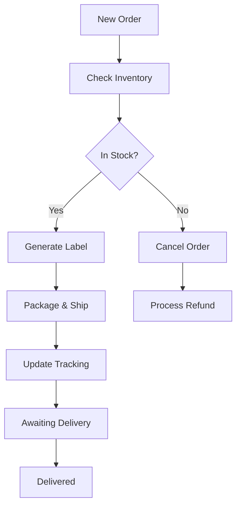

# 18. FBS API

**FBS API** - Comprehensive Fulfillment by Seller operations and posting management for OZON Seller API.

## Overview

The FBS (Fulfillment by Seller) API provides complete management of seller-fulfilled orders where the seller handles storage, packaging, and shipping directly to customers. This comprehensive API covers posting management, label generation, status tracking, and product operations across 22 specialized methods.

### Key Features
- **Posting Management**: Complete order lifecycle from creation to delivery
- **Label Generation**: Automated shipping label creation and batch processing
- **Status Tracking**: Real-time posting status updates and delivery tracking
- **Product Operations**: Product changes, cancellations, and country settings
- **Quality Control**: Arbitration handling and restriction management

---

## 📋 Methods Overview

Due to the comprehensive nature of this API (22 methods), documentation is split into specialized sections:

### 📦 Core Posting Operations
1. **[Posting Management →](./18-fbs-posting.md)** (8 methods)
   - getPostingV3, getPostingListV3, getUnfulfilledListV3
   - moveToAwaitingDelivery, moveToArbitration, cancelPosting
   - getPostingByBarcode, setMultiBoxQtyV3

2. **[Label & Shipping →](./18-fbs-labels.md)** (6 methods)
   - packageLabel, createLabelBatch, createLabelBatchV2
   - getLabelBatch, verifyPickupCode, getRestrictions

### 📋 Product & Administrative Operations
3. **[Product & Cancel Management →](./18-fbs-products.md)** (6 methods)
   - cancelProducts, changeProducts, getProductCountriesList
   - setProductCountry, getCancelReasons, getCancelReasonsList

4. **[Legal & Compliance →](./18-fbs-compliance.md)** (2 methods)
   - getEtgb, getUnpaidLegalProductList

---

## 🚀 Quick Start Example

```typescript
import { OzonSellerAPI } from 'daytona-ozon-seller-api';

const api = new OzonSellerAPI({
  clientId: 'your-client-id',
  apiKey: 'your-api-key'
});

// Complete FBS workflow example
async function fbsWorkflowExample() {
  // 1. Get unfulfilled orders
  const unfulfilledOrders = await api.fbs.getUnfulfilledListV3({
    limit: 50
  });
  
  console.log(`Found ${unfulfilledOrders.postings?.length} orders to fulfill`);

  // 2. Process each order
  for (const posting of unfulfilledOrders.postings || []) {
    try {
      // Generate shipping label
      const label = await api.fbs.packageLabel({
        posting_number: [posting.posting_number!]
      });
      
      console.log(`Label generated for ${posting.posting_number}`);

      // Move to awaiting delivery
      const moved = await api.fbs.moveToAwaitingDelivery({
        posting_number: posting.posting_number!,
        carrier_id: 1,
        tracking_number: `TRACK${Date.now()}`
      });
      
      if (moved.result) {
        console.log(`${posting.posting_number} moved to delivery`);
      }
      
    } catch (error) {
      console.error(`Failed to process ${posting.posting_number}:`, error.message);
      
      // Cancel if cannot fulfill
      await api.fbs.cancelPosting({
        posting_number: posting.posting_number!,
        cancel_reason_id: 402,
        cancel_reason_message: 'Unable to fulfill order'
      });
    }
  }

  // 3. Get posting statistics
  const postings = await api.fbs.getPostingListV3({
    filter: {
      since: '2024-01-01T00:00:00Z',
      to: '2024-01-31T23:59:59Z',
      status: 'delivered'
    },
    limit: 1000
  });
  
  console.log(`Delivered ${postings.postings?.length} orders this month`);
}
```

---

## 🔄 FBS Business Flow

### Standard FBS Workflow


### Integration Points
1. **Order Management** → Inventory synchronization
2. **Label Generation** → Shipping provider integration
3. **Tracking Updates** → Carrier API integration
4. **Delivery Confirmation** → Customer notification
5. **Returns Processing** → Reverse logistics

---

## 📊 Core Data Models

### FBS Posting Structure
```typescript
interface FbsPosting {
  posting_number: string;
  status: 'awaiting_packaging' | 'awaiting_deliver' | 'delivering' | 'delivered' | 'cancelled';
  created_at: string;
  in_process_at: string;
  
  // Customer info
  customer: {
    address: CustomerAddress;
    name: string;
    phone: string;
  };
  
  // Products
  products: Array<{
    offer_id: string;
    name: string;
    price: string;
    quantity: number;
    sku: number;
  }>;
  
  // Delivery
  delivery_method: {
    id: number;
    name: string;
    warehouse_id: number;
  };
  
  // Tracking
  tracking_number?: string;
  carrier_id?: number;
  
  // Logistics
  required_meta?: Array<{
    type: string;
    value: string;
  }>;
}
```

### Label Batch Structure
```typescript
interface FbsLabelBatch {
  task_id: string;
  status: 'pending' | 'processing' | 'completed' | 'error';
  labels?: Array<{
    posting_number: string;
    label_url: string;
    created_at: string;
  }>;
  total_count: number;
  processed_count: number;
  error_count: number;
}
```

---

## 🎯 Key Benefits

### For Sellers
- **Direct Control**: Full control over fulfillment process
- **Cost Optimization**: No OZON fulfillment fees
- **Customer Relationships**: Direct customer interaction
- **Inventory Management**: Real-time inventory control

### For Operations
- **Scalable Processing**: Handle high-volume orders efficiently
- **Automated Workflows**: Reduce manual intervention
- **Quality Control**: Built-in validation and error handling
- **Performance Tracking**: Comprehensive analytics and monitoring

---

## ⚠️ Important Considerations

### Business Rules
- **SLA Requirements**: Strict processing time limits
- **Quality Standards**: Package and shipping quality requirements
- **Customer Service**: Direct responsibility for customer issues
- **Return Handling**: Seller manages returns and refunds

### Technical Requirements
- **Real-time Updates**: Status updates must be timely
- **Label Compliance**: Shipping labels must meet carrier standards
- **Tracking Integration**: Accurate tracking number provision
- **Error Handling**: Robust error recovery and notification

### Cost Implications
- **Shipping Costs**: Seller bears all shipping expenses
- **Packaging Materials**: Investment in proper packaging
- **Storage Costs**: Inventory storage and management
- **Processing Time**: Time investment in order fulfillment

---

## 📖 Detailed Documentation

### Comprehensive Method Coverage

Each specialized section provides:
- **Complete TypeScript interfaces** for all requests/responses
- **Practical code examples** with real-world scenarios
- **Business workflow patterns** and best practices
- **Error handling strategies** and recovery patterns
- **Performance optimization techniques**

### Documentation Sections

1. **[18-fbs-posting.md](./18-fbs-posting.md)** - Posting Management
   - Order retrieval and status management
   - Delivery coordination and tracking
   - Multi-box quantity handling
   - Barcode scanning and validation

2. **[18-fbs-labels.md](./18-fbs-labels.md)** - Label & Shipping
   - Label generation and batch processing
   - Shipping restriction management
   - Pickup code verification
   - Carrier integration patterns

3. **[18-fbs-products.md](./18-fbs-products.md)** - Product & Cancel Management
   - Product modifications and cancellations
   - Country origin management
   - Cancellation reason handling
   - Inventory adjustment workflows

4. **[18-fbs-compliance.md](./18-fbs-compliance.md)** - Legal & Compliance
   - ETGB (electronic customs declaration) management
   - Legal entity product tracking
   - Compliance reporting and validation

---

## 🔗 Related Documentation

- **[FBO API (16-fbo.md)](./16-fbo.md)** - OZON-fulfilled operations
- **[Delivery FBS API (14-delivery-fbs.md)](./14-delivery-fbs.md)** - FBS delivery management
- **[Return API (return.md)](./return.md)** - Returns and refunds processing

---

**Implementation Status**: ✅ Complete  
**Last Updated**: 2024  
**API Version**: v3  
**Methods Count**: 22 methods across 4 specialized sections