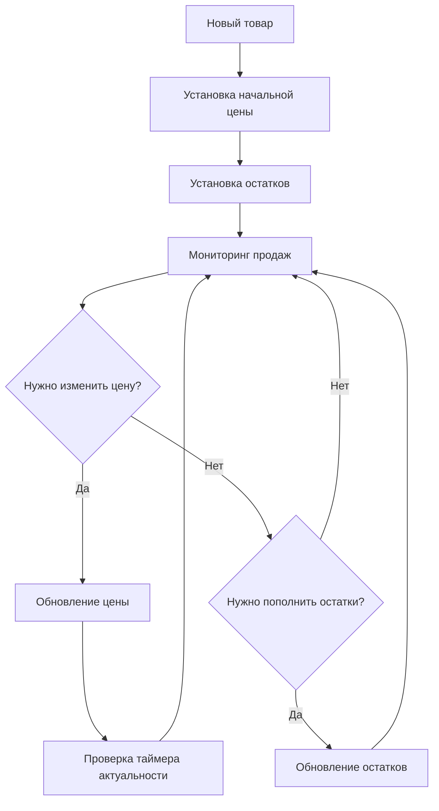

# 22. API Цены и Остатки

**API Цены и Остатки** - Управление ценами и остатками товаров для OZON Seller API.

## Обзор

API Цены и Остатки предоставляет полный контроль над ценообразованием и управлением остатками товаров. Этот комплексный API охватывает обновление цен, управление остатками, работу с уценёнными товарами, таймеры актуальности цен и отчетность по складам через 9 специализированных методов.

### Ключевые особенности
- **Управление ценами**: Обновление цен, старых цен и премиум-цен
- **Управление остатками**: Контроль количества товаров на складах
- **Уценённые товары**: Работа с товарами со скидками и дефектами
- **Таймеры актуальности**: Автоматическое управление актуальностью минимальных цен
- **FBS/rFBS поддержка**: Полная поддержка схем выполнения продавцом
- **Складская аналитика**: Детальная информация по остаткам на складах

### Ограничения и лимиты
- **Цены**: Не более 10 обновлений в час на товар
- **Остатки**: До 80 запросов в минуту, до 100 товаров за запрос
- **API версии**: v1, v2, v4, v5 (различные методы используют разные версии)

---

## 📋 Обзор методов

Из-за комплексного характера этого API (9 методов), документация разделена на специализированные разделы:

### 📊 Управление ценами
1. **[Управление ценами →](./22-prices-stocks-prices.md)** (3 метода)
   - updatePrices, getPrices, updateDiscountedProductDiscount
   - Обновление цен, получение информации о ценах, скидки на уценённые товары

2. **[Таймеры актуальности →](./22-prices-stocks-timers.md)** (2 метода)
   - getActionTimerStatus, updateActionTimer
   - Управление таймерами актуальности минимальных цен

### 📦 Управление остатками
3. **[Управление остатками →](./22-prices-stocks-stocks.md)** (3 метода)
   - updateStocks, getStocks, getStocksByWarehouseFbs
   - Обновление остатков, информация по складам FBS/rFBS

### 🏷️ Специальные товары
4. **[Уценённые товары →](./22-prices-stocks-discounted.md)** (1 метод)
   - getDiscountedProductInfo
   - Информация об уценённых товарах и их состоянии

---

## 🚀 Quick Start пример

```typescript
import { OzonSellerAPI } from 'daytona-ozon-seller-api';

const api = new OzonSellerAPI({
  clientId: 'ваш-client-id',
  apiKey: 'ваш-api-key'
});

// Полный рабочий процесс управления ценами и остатками
async function completeManagementProcess() {
  // 1. Обновление цен товаров
  const pricesUpdate = await api.pricesStocks.updatePrices({
    prices: [{
      offer_id: 'ТОВАР001',
      price: '1500',
      old_price: '2000',
      premium_price: '1400',
      currency_code: 'RUB'
    }, {
      offer_id: 'ТОВАР002',
      price: '999',
      old_price: '0', // Сбрасываем старую цену
      currency_code: 'RUB'
    }]
  });
  
  console.log(`💰 Обновлено цен: ${pricesUpdate.result?.length}`);
  
  // 2. Обновление остатков товаров
  const stocksUpdate = await api.pricesStocks.updateStocks({
    stocks: [{
      offer_id: 'ТОВАР001',
      stock: 100,
      warehouse_id: 12345
    }, {
      offer_id: 'ТОВАР002', 
      stock: 50,
      warehouse_id: 12345
    }]
  });
  
  console.log(`📦 Обновлено остатков: ${stocksUpdate.result?.length}`);
  
  // 3. Получение информации о текущих ценах
  const currentPrices = await api.pricesStocks.getPrices({
    filter: {
      offer_id: ['ТОВАР001', 'ТОВАР002'],
      visibility: 'VISIBLE'
    },
    limit: 100
  });
  
  console.log(`📊 Найдено товаров с ценами: ${currentPrices.items?.length}`);
  
  // 4. Получение информации об остатках
  const currentStocks = await api.pricesStocks.getStocks({
    filter: {
      offer_id: ['ТОВАР001', 'ТОВАР002'],
      visibility: 'VISIBLE'
    },
    limit: 100
  });
  
  console.log(`📊 Найдено товаров с остатками: ${currentStocks.items?.length}`);
  
  // 5. Проверка таймеров актуальности цен
  const timerStatus = await api.pricesStocks.getActionTimerStatus({
    product_ids: ['123456', '789012']
  });
  
  console.log(`⏰ Проверено таймеров: ${timerStatus.statuses?.length}`);
  
  // 6. Получение детальной информации по складам (FBS)
  const warehouseInfo = await api.pricesStocks.getStocksByWarehouseFbs({
    sku: ['123456789', '987654321']
  });
  
  console.log(`🏭 Найдено товаров на складах: ${warehouseInfo.result?.length}`);
  
  // Вывод результатов
  currentPrices.items?.forEach(product => {
    console.log(`\n📋 Товар: ${product.offer_id}`);
    console.log(`   💰 Цена: ${product.price} ${product.currency_code}`);
    if (product.old_price && product.old_price !== '0') {
      console.log(`   🏷️ Старая цена: ${product.old_price} ${product.currency_code}`);
    }
    if (product.premium_price) {
      console.log(`   ⭐ Premium цена: ${product.premium_price} ${product.currency_code}`);
    }
  });
  
  currentStocks.items?.forEach(product => {
    console.log(`\n📦 Остатки ${product.offer_id}:`);
    product.stocks?.forEach(stock => {
      console.log(`   🏭 Склад ${stock.warehouse_id}: ${stock.present} в наличии, ${stock.reserved} зарезервировано`);
    });
  });
}
```

---

## 🔄 Бизнес-процессы

### Стандартный процесс управления ценами и остатками


### Точки интеграции
1. **Управление товарами** → Синхронизация каталога товаров
2. **Складская система** → Автоматическое обновление остатков
3. **Ценообразование** → Динамическое управление ценами
4. **Аналитика** → Отчеты по продажам и остаткам
5. **Автоматизация** → Таймеры и правила ценообразования

---

## 📊 Основные модели данных

### Структура цены товара
```typescript
interface ЦенаТовара {
  offer_id?: string;              // ID товара продавца
  product_id?: number;            // ID товара в системе OZON
  price: string;                  // Текущая цена товара (обязательно)
  old_price?: string;             // Старая цена (для показа скидки, "0" = сброс)
  premium_price?: string;         // Цена для Premium подписчиков
  currency_code: string;          // Валюта (обычно RUB)
  
  // Дополнительные поля в ответах
  auto_action_enabled?: boolean;  // Включены ли автоправила цены
  commissions?: {                 // Информация о комиссиях
    fbo?: number;                 // Комиссия FBO
    fbs?: number;                 // Комиссия FBS
    rfbs?: number;                // Комиссия rFBS
  };
  marketing_actions?: Array<{     // Маркетинговые акции
    title: string;                // Название акции
    action_type: string;          // Тип акции
  }>;
}
```

### Структура остатков товара
```typescript
interface ОстаткиТовара {
  offer_id?: string;              // ID товара продавца  
  product_id?: number;            // ID товара в системе OZON
  sku: string;                    // SKU товара
  warehouse_id: number;           // ID склада
  
  // Информация об остатках
  stock?: number;                 // Устанавливаемое количество (для обновления)
  present?: number;               // Количество в наличии
  reserved?: number;              // Количество зарезервировано покупателями
  
  // Дополнительные поля
  warehouse_name?: string;        // Название склада
  available?: number;             // Доступно для продажи (present - reserved)
}
```

### Типы видимости товаров
```typescript
type ВидимостьТовара = 
  | 'ALL'                        // Все товары
  | 'VISIBLE'                    // Видимые товары  
  | 'INVISIBLE'                  // Скрытые товары
  | 'EMPTY_STOCK'                // Товары с нулевыми остатками
  | 'NOT_MODERATED'              // Не промодерированные
  | 'MODERATED'                  // Промодерированные
  | 'DISABLED'                   // Отключенные
  | 'STATE_FAILED';              // С ошибками модерации
```

---

## 🎯 Ключевые преимущества

### Для продавцов
- **Полный контроль цен**: Гибкое управление ценообразованием с поддержкой акций
- **Автоматизация**: Таймеры актуальности и правила ценообразования
- **Мульти-складская поддержка**: Управление остатками на разных складах
- **Уценённые товары**: Специальная работа с товарами со скидками

### Для операций
- **Массовые операции**: Обновление до 100 товаров за один запрос
- **Высокая производительность**: До 80 запросов в минуту для остатков
- **Детальная аналитика**: Подробная информация по складам и резервам
- **Гибкая фильтрация**: Множественные критерии для поиска и группировки

---

## ⚠️ Важные особенности

### Бизнес-правила
- **Лимиты обновления цен**: Не более 10 раз в час на товар
- **Производительность остатков**: До 80 запросов в минуту
- **Размер пакетов**: До 100 товаров за один запрос обновления
- **Схемы выполнения**: Полная поддержка FBS, rFBS и FBO

### Технические требования
- **Валидация данных**: Обязательная проверка цен и остатков
- **Обработка ошибок**: Детальная информация об ошибках для каждого товара
- **Синхронизация**: Актуальная информация в реальном времени
- **Версионность API**: Разные методы используют разные версии API

### Рекомендации по использованию
- **Мониторинг лимитов**: Отслеживание частоты обновлений
- **Пакетная обработка**: Группировка товаров для эффективности
- **Обработка ошибок**: Повторные попытки для неуспешных обновлений
- **Кэширование**: Сохранение данных для уменьшения нагрузки на API

---

## 📖 Подробная документация

### Полное покрытие методов

Каждый специализированный раздел предоставляет:
- **Полные TypeScript интерфейсы** для всех запросов/ответов
- **Практические примеры кода** с реальными сценариями
- **Бизнес-процессы** и лучшие практики
- **Стратегии обработки ошибок** и восстановления
- **Техники оптимизации производительности**

### Разделы документации

1. **[22-prices-stocks-prices.md](./22-prices-stocks-prices.md)** - Управление ценами
   - Обновление и получение цен товаров
   - Работа со старыми ценами и акциями
   - Премиум-цены для подписчиков
   - Уценённые товары и скидки

2. **[22-prices-stocks-timers.md](./22-prices-stocks-timers.md)** - Таймеры актуальности
   - Управление таймерами минимальных цен
   - Статус и обновление таймеров
   - Автоматические правила ценообразования

3. **[22-prices-stocks-stocks.md](./22-prices-stocks-stocks.md)** - Управление остатками
   - Обновление количества товаров на складах
   - Информация по схемам FBS и rFBS
   - Резервы и доступные остатки

4. **[22-prices-stocks-discounted.md](./22-prices-stocks-discounted.md)** - Уценённые товары
   - Информация о состоянии и дефектах
   - Связь с основными товарами
   - Управление скидками

---

## 🔗 Связанная документация

- **[API Товары (product.md)](./product.md)** - Управление каталогом товаров
- **[API Аналитика (analytics.md)](./analytics.md)** - Аналитика продаж и остатков
- **[API Склады (warehouse.md)](./warehouse.md)** - Операции со складами

---

**Статус реализации**: ✅ Завершено  
**Последнее обновление**: 2024  
**Версии API**: v1, v2, v4, v5  
**Количество методов**: 9 методов в 4 специализированных разделах