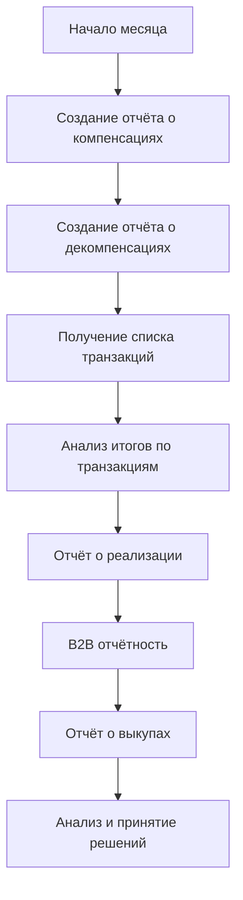

# 23. API Финансы

**API Финансы** - Полная система финансовой отчётности и управления транзакциями для OZON Seller API.

## Обзор

API Финансы предоставляет комплексный доступ к финансовой отчётности, аналитике и управлению транзакциями в экосистеме OZON. Этот критически важный API включает 10 специализированных методов для работы с компенсациями, отчётами о реализации, B2B продажами, взаиморасчётами и финансовыми транзакциями.

### Ключевые возможности
- **Отчёты о компенсациях**: Компенсации и декомпенсации
- **Реализационная отчётность**: Детальная отчётность по продажам
- **B2B документооборот**: Специальная отчётность для юридических лиц
- **Взаиморасчёты**: Финансовые операции между продавцом и OZON
- **Транзакционная аналитика**: Детальный анализ всех финансовых операций
- **Выкупы товаров**: Отчёты по товарам, выкупленным OZON
- **Многоверсионность API**: v1, v2, v3 для различных типов операций

### Ограничения и особенности
- **Период отчётности**: До 31 дня для большинства отчётов
- **Форматы данных**: Excel, JSON, CSV
- **Языки**: RU, EN для отчётов
- **Валюты**: Рубли (RUB) как основная валюта расчётов

---

## 📊 Методы API

### 💰 Компенсационные отчёты

#### 1. **createCompensationReport** - Отчёт о компенсациях
Создаёт отчёт о компенсациях, выплаченных продавцу за указанный период.

```typescript
async createCompensationReport(
  request: GetCompensationReportRequest,
  options?: RequestOptions
): Promise<CreateReportResponse>
```

**Параметры запроса:**
```typescript
interface GetCompensationReportRequest {
  date: string;      // Период в формате YYYY-MM
  language: 'RU' | 'EN';
}
```

**Ответ:**
```typescript
interface CreateReportResponse {
  result?: {
    code: 'SUCCESS' | 'ERROR';
    description?: string;
  };
}
```

#### 2. **createDecompensationReport** - Отчёт о декомпенсациях
Создаёт отчёт о возврате компенсаций (декомпенсациях) за указанный период.

```typescript
async createDecompensationReport(
  request: GetDecompensationReportRequest,
  options?: RequestOptions
): Promise<CreateReportResponse>
```

### 🏢 B2B отчётность

#### 3. **createDocumentB2BSalesReport** - Реестр продаж юрлицам
Создаёт отчёт с информацией о продажах юридическим лицам.

```typescript
async createDocumentB2BSalesReport(
  request: CreateDocumentB2BSalesReportRequest,
  options?: RequestOptions
): Promise<CommonCreateReportResponse>
```

#### 4. **createDocumentB2BSalesJSONReport** - Реестр продаж B2B в JSON
Создаёт отчёт о продажах юридическим лицам в формате JSON.

```typescript
async createDocumentB2BSalesJSONReport(
  request: CreateDocumentB2BSalesJSONReportRequest,
  options?: RequestOptions
): Promise<CreateDocumentB2BSalesJSONReportResponse>
```

### 🔄 Взаиморасчёты

#### 5. **createMutualSettlementReport** - Отчёт о взаиморасчётах
Создаёт отчёт о взаиморасчётах между продавцом и OZON.

```typescript
async createMutualSettlementReport(
  request: CreateMutualSettlementReportRequest,
  options?: RequestOptions
): Promise<CommonCreateReportResponse>
```

### 📦 Выкупы и реализация

#### 6. **getProductsBuyout** - Отчёт о выкупленных товарах
Получает отчёт о товарах, выкупленных OZON у продавца (максимум 31 день).

```typescript
async getProductsBuyout(
  request: GetFinanceProductsBuyoutRequest,
  options?: RequestOptions
): Promise<GetFinanceProductsBuyoutResponse>
```

**Параметры запроса:**
```typescript
interface GetFinanceProductsBuyoutRequest {
  date: {
    from: string;    // YYYY-MM-DD
    to: string;      // YYYY-MM-DD (максимум 31 день)
  };
}
```

#### 7. **getRealizationReportPosting** - Отчёт о реализации (позаказный)
Получает отчёт о реализации товаров с группировкой по отправлениям.

```typescript
async getRealizationReportPosting(
  request: GetRealizationReportPostingRequest,
  options?: RequestOptions
): Promise<GetRealizationReportPostingResponse>
```

#### 8. **getRealizationReportV2** - Отчёт о реализации v2
Получает отчёт о реализации товаров за указанный месяц (улучшенный формат).

```typescript
async getRealizationReportV2(
  request: GetRealizationReportV2Request,
  options?: RequestOptions
): Promise<GetRealizationReportV2Response>
```

### 💳 Транзакционная аналитика

#### 9. **getTransactionList** - Список транзакций v3
Получает список финансовых транзакций с расширенной фильтрацией и пагинацией.

```typescript
async getTransactionList(
  request: FinanceTransactionListV3Request,
  options?: RequestOptions
): Promise<FinanceTransactionListV3Response>
```

**Параметры запроса:**
```typescript
interface FinanceTransactionListV3Request {
  page: number;
  page_size: number;
  filter: {
    date: {
      from: string;
      to: string;
    };
    transaction_type?: string[];
    posting_number?: string[];
  };
}
```

#### 10. **getTransactionTotals** - Итоги по транзакциям v3
Получает агрегированные данные по транзакциям за период или отправление.

```typescript
async getTransactionTotals(
  request: FinanceTransactionTotalsV3Request,
  options?: RequestOptions
): Promise<FinanceTransactionTotalsV3Response>
```

---

## 🚀 Практические примеры

### Комплексный пример финансовой отчётности

```typescript
import { OzonSellerAPI } from 'daytona-ozon-seller-api';

const api = new OzonSellerAPI({
  clientId: 'ваш-client-id',
  apiKey: 'ваш-api-key'
});

// Полный цикл финансовой отчётности
async function completeFinancialAnalysis() {
  const currentMonth = '2024-01';
  const datePeriod = {
    from: '2024-01-01',
    to: '2024-01-31'
  };

  // 1. Создание отчёта о компенсациях
  console.log('📊 Создание отчёта о компенсациях...');
  const compensations = await api.finance.createCompensationReport({
    date: currentMonth,
    language: 'RU'
  });

  if (compensations.result?.code === 'SUCCESS') {
    console.log('✅ Отчёт о компенсациях создан');
  }

  // 2. Отчёт о декомпенсациях
  console.log('📊 Создание отчёта о декомпенсациях...');
  const decompensations = await api.finance.createDecompensationReport({
    date: currentMonth,
    language: 'RU'
  });

  // 3. Получение списка транзакций
  console.log('💳 Загрузка транзакций...');
  const transactions = await api.finance.getTransactionList({
    page: 1,
    page_size: 100,
    filter: {
      date: datePeriod,
      transaction_type: ['orders', 'returns', 'compensation']
    }
  });

  console.log(`💰 Найдено транзакций: ${transactions.result?.operations?.length}`);

  // 4. Получение итогов по транзакциям
  const totals = await api.finance.getTransactionTotals({
    filter: {
      date: datePeriod
    }
  });

  console.log(`💸 Общая сумма операций: ${totals.result?.total_amount} RUB`);

  // 5. Отчёт о выкупленных товарах
  const buyouts = await api.finance.getProductsBuyout({
    date: datePeriod
  });

  console.log(`📦 Выкуплено товаров: ${buyouts.result?.products?.length}`);

  // 6. Отчёт о реализации (v2)
  const realization = await api.finance.getRealizationReportV2({
    month: currentMonth,
    language: 'RU'
  });

  // Анализ результатов
  if (realization.result?.header && realization.result?.data) {
    console.log('\n📈 Анализ реализации:');
    realization.result.data.forEach(row => {
      console.log(`SKU: ${row[0]}, Название: ${row[1]}, Выручка: ${row[2]}`);
    });
  }

  return {
    compensations,
    transactions,
    totals,
    buyouts,
    realization
  };
}
```

### B2B отчётность для юридических лиц

```typescript
// Специализированная B2B отчётность
async function createB2BReports() {
  const period = '2024-01';

  // 1. Создание B2B отчёта в Excel
  const b2bReport = await api.finance.createDocumentB2BSalesReport({
    date: period,
    language: 'RU'
  });

  if (b2bReport.result?.url) {
    console.log(`📄 B2B отчёт готов: ${b2bReport.result.url}`);
  }

  // 2. Получение B2B данных в JSON
  const b2bJSON = await api.finance.createDocumentB2BSalesJSONReport({
    date: period
  });

  // Анализ счетов для юрлиц
  if (b2bJSON.result?.invoices) {
    console.log('\n🏢 Анализ B2B продаж:');
    
    let totalAmount = 0;
    b2bJSON.result.invoices.forEach(invoice => {
      console.log(`Счёт №${invoice.invoice_number}: ${invoice.amount} RUB`);
      totalAmount += parseFloat(invoice.amount);
    });
    
    console.log(`💰 Общая сумма B2B продаж: ${totalAmount} RUB`);
  }

  return { b2bReport, b2bJSON };
}
```

### Мониторинг финансовых показателей

```typescript
// Класс для мониторинга финансов
class FinanceMonitoring {
  constructor(private api: OzonSellerAPI) {}

  async dailyMonitoring(): Promise<FinanceAnalytics> {
    const yesterday = new Date();
    yesterday.setDate(yesterday.getDate() - 1);
    
    const period = {
      from: yesterday.toISOString().split('T')[0],
      to: yesterday.toISOString().split('T')[0]
    };

    // Получение транзакций за вчера
    const transactions = await this.api.finance.getTransactionList({
      page: 1,
      page_size: 1000,
      filter: {
        date: period
      }
    });

    // Получение итогов
    const totals = await this.api.finance.getTransactionTotals({
      filter: {
        date: period
      }
    });

    // Анализ данных
    return this.analyzeData(transactions, totals);
  }

  private analyzeData(
    transactions: FinanceTransactionListV3Response,
    totals: FinanceTransactionTotalsV3Response
  ): FinanceAnalytics {
    const operations = transactions.result?.operations || [];
    
    return {
      totalRevenue: totals.result?.total_amount || 0,
      operationsCount: operations.length,
      averageOperationAmount: operations.length > 0 
        ? (totals.result?.total_amount || 0) / operations.length 
        : 0,
      operationTypes: this.groupByType(operations),
      recommendations: this.generateRecommendations(operations, totals)
    };
  }

  private groupByType(operations: any[]): Record<string, number> {
    return operations.reduce((groups, operation) => {
      const type = operation.operation_type || 'unknown';
      groups[type] = (groups[type] || 0) + 1;
      return groups;
    }, {});
  }

  private generateRecommendations(
    transactions: FinanceTransactionListV3Response,
    totals: FinanceTransactionTotalsV3Response
  ): string[] {
    const recommendations: string[] = [];
    const operations = transactions.result?.operations || [];

    if (operations.length === 0) {
      recommendations.push('Нет транзакций за период - проверьте активность продаж');
    }

    if ((totals.result?.total_amount || 0) < 0) {
      recommendations.push('Отрицательный баланс - проверьте компенсации и возвраты');
    }

    const returns = operations.filter(op => op.operation_type === 'returns').length;
    if (returns > operations.length * 0.1) {
      recommendations.push('Высокий процент возвратов - анализируйте качество товаров');
    }

    return recommendations;
  }
}

interface FinanceAnalytics {
  totalRevenue: number;
  operationsCount: number;
  averageOperationAmount: number;
  operationTypes: Record<string, number>;
  recommendations: string[];
}
```

---

## 🔄 Бизнес-процессы

### Стандартный процесс финансовой отчётности


### Точки интеграции
1. **Бухгалтерия** → Автоматический экспорт отчётов
2. **Налоговая отчётность** → B2B документооборот
3. **Аналитические системы** → Транзакционные данные
4. **Планирование** → Прогнозирование на основе финансовых трендов

---

## 📊 Структуры данных

### Типы транзакций
```typescript
type ТипТранзакции = 
  | 'orders'           // Заказы
  | 'returns'          // Возвраты
  | 'compensation'     // Компенсации
  | 'services'         // Услуги
  | 'adjustments';     // Корректировки

interface ТранзакцияV3 {
  operation_id: string;
  operation_type: ТипТранзакции;
  operation_date: string;
  posting_number?: string;
  amount: number;
  currency_code: 'RUB';
  description: string;
  details?: {
    product_name?: string;
    sku?: number;
    commission_amount?: number;
    commission_percent?: number;
  };
}
```

### Структура отчёта о реализации
```typescript
interface RealizationReport {
  header: string[];           // Заголовки колонок
  data: RealizationRow[];
}

interface RealizationRow {
  sku: string;
  product_name: string;
  price: number;
  commission_amount: number;
  commission_percent: number;
  sold_amount: number;
  return_amount: number;
  net_amount: number;
  currency_code: 'RUB';
}
```

### B2B документы
```typescript
interface B2BInvoice {
  invoice_number: string;
  invoice_date: string;
  company_name: string;
  inn: string;
  amount: string;
  currency_code: 'RUB';
  status: 'paid' | 'pending' | 'cancelled';
}
```

---

## ⚠️ Важные особенности

### Бизнес-правила
- **Период отчётности**: Максимум 31 день для детальных отчётов
- **Валюта расчётов**: Рубли (RUB) как основная валюта
- **Форматы отчётов**: Excel, JSON, CSV в зависимости от метода
- **Языки интерфейса**: Русский (RU) и английский (EN)

### Технические ограничения
- **API версии**: v1, v2, v3 для разных групп методов
- **Размер ответа**: Пагинация для больших объёмов данных
- **Кэширование**: Отчёты могут кэшироваться на стороне OZON
- **Время генерации**: Некоторые отчёты создаются асинхронно

### Рекомендации по использованию
- **Регулярность отчётов**: Ежемесячная генерация основных отчётов
- **Мониторинг транзакций**: Ежедневная проверка финансовых операций
- **B2B интеграция**: Автоматизация для корпоративных клиентов
- **Анализ трендов**: Сравнение показателей по периодам

---

**Статус реализации**: ✅ Завершено  
**Последнее обновление**: 2024  
**Версии API**: v1, v2, v3  
**Количество методов**: 10 методов финансовой отчётности