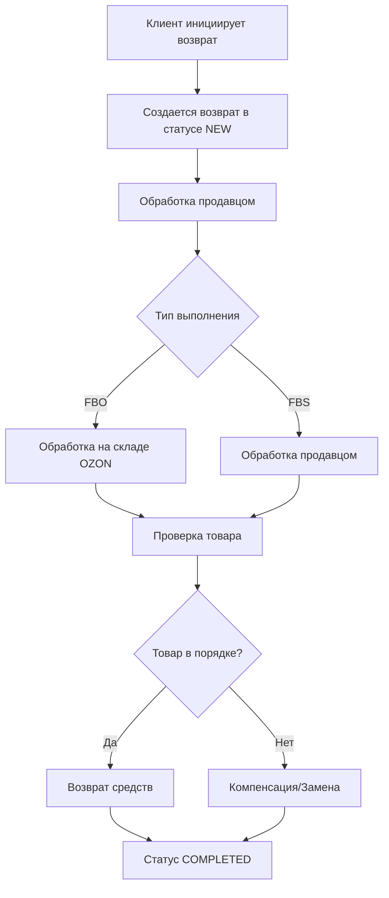

# 24. API Возвраты

**API Возвраты** - Управление возвратами товаров по схемам FBO и FBS для OZON Seller API.

## Обзор

API Возвраты предоставляет возможность получения информации о возвратах товаров с полной фильтрацией и пагинацией. Поддерживает как схему FBO (выполнение OZON), так и FBS (выполнение продавцом) с детальной информацией о статусах, причинах возвратов и сроках обработки.

### Ключевые возможности
- **Единый интерфейс**: Обработка возвратов FBO и FBS в одном API
- **Расширенная фильтрация**: По датам, статусам, причинам возврата
- **Пагинация**: Эффективная работа с большими объемами данных
- **Детальная информация**: Полные данные о товарах, клиентах и причинах возврата

### Типы возвратов
- **FBO возвраты**: Обрабатываются на складах OZON
- **FBS возвраты**: Обрабатываются продавцом
- **Различные причины**: Брак, несоответствие, инициатива покупателя

---

## 📊 Методы API

### 📋 Получение информации

#### **getList** - Получение списка возвратов
Получение информации о возвратах FBO и FBS с фильтрацией и пагинацией.

```typescript
async getList(
  request: GetReturnsListRequest,
  options?: RequestOptions
): Promise<GetReturnsListResponse>
```

**Параметры запроса:**
```typescript
interface GetReturnsListRequest {
  filter?: {
    created_at_from?: string;       // Дата создания возврата от (ISO 8601)
    created_at_to?: string;         // Дата создания возврата до (ISO 8601)
    status?: ReturnStatus[];        // Фильтр по статусам возврата
    posting_number?: string;        // Номер отправления
    return_id?: number;             // ID возврата
  };
  limit?: number;                   // Лимит записей (по умолчанию 100)
  offset?: number;                  // Смещение для пагинации
}

type ReturnStatus = 
  | 'NEW'                          // Новый возврат
  | 'PROCESSING'                   // В обработке
  | 'COMPLETED'                    // Завершен
  | 'CANCELLED'                    // Отменен
  | 'AWAITING_DELIVERY'            // Ожидает доставки
  | 'DELIVERED'                    // Доставлен
  | 'AWAITING_RETURN'              // Ожидает возврата
  | 'RETURNED';                    // Возвращен
```

**Интерфейс ответа:**
```typescript
interface GetReturnsListResponse {
  returns?: Array<{
    return_id: number;             // ID возврата
    posting_number: string;        // Номер отправления
    status: ReturnStatus;          // Статус возврата
    created_at: string;            // Дата создания возврата
    
    // Информация о товаре
    products: Array<{
      sku: number;                 // SKU товара
      offer_id: string;            // ID товара продавца
      name: string;                // Название товара
      price: string;               // Цена товара
      quantity: number;            // Количество возвращаемых единиц
    }>;
    
    // Информация о возврате
    return_reason?: {
      code: string;                // Код причины возврата
      name: string;                // Название причины возврата
      description?: string;        // Подробное описание
    };
    
    // Дополнительная информация
    customer_info?: {
      customer_id?: string;        // ID покупателя
      customer_name?: string;      // Имя покупателя
    };
    
    // Финансовая информация
    compensation?: {
      amount: string;              // Сумма компенсации
      currency_code: string;       // Валюта компенсации
    };
    
    // Логистическая информация  
    delivery_info?: {
      tracking_number?: string;    // Трек-номер возврата
      expected_delivery?: string;  // Ожидаемая дата доставки
      actual_delivery?: string;    // Фактическая дата доставки
    };
  }>;
  
  // Информация о пагинации
  count?: number;                  // Общее количество возвратов
  has_next?: boolean;              // Есть ли следующая страница
}
```

---

## 🚀 Практические примеры

### Комплексный пример работы с возвратами

```typescript
import { OzonSellerAPI } from 'daytona-ozon-seller-api';

const api = new OzonSellerAPI({
  clientId: 'ваш-client-id',
  apiKey: 'ваш-api-key'
});

// Полный анализ возвратов за период
async function completeReturnsAnalysis() {
  const dateFrom = '2024-01-01T00:00:00Z';
  const dateTo = '2024-01-31T23:59:59Z';

  console.log('📋 Анализ возвратов за период...');

  // 1. Получение всех возвратов за период
  const allReturns = await getAllReturnsForPeriod(dateFrom, dateTo);
  console.log(`📊 Всего возвратов за период: ${allReturns.length}`);

  // 2. Анализ по статусам
  const statusAnalysis = analyzeReturnsByStatus(allReturns);
  console.log('\n📈 Распределение по статусам:');
  Object.entries(statusAnalysis).forEach(([status, count]) => {
    console.log(`   ${status}: ${count} возвратов`);
  });

  // 3. Анализ причин возвратов
  const reasonAnalysis = analyzeReturnReasons(allReturns);
  console.log('\n🔍 Основные причины возвратов:');
  Object.entries(reasonAnalysis)
    .sort(([,a], [,b]) => b - a)
    .slice(0, 5)
    .forEach(([reason, count]) => {
      console.log(`   ${reason}: ${count} случаев`);
    });

  // 4. Финансовая аналитика
  const financialImpact = calculateFinancialImpact(allReturns);
  console.log('\n💰 Финансовое влияние возвратов:');
  console.log(`   Общая сумма компенсаций: ${financialImpact.totalCompensation} RUB`);
  console.log(`   Средняя сумма возврата: ${financialImpact.averageReturn} RUB`);

  // 5. Рекомендации по улучшению
  const recommendations = generateRecommendations(allReturns, reasonAnalysis);
  console.log('\n💡 Рекомендации по снижению возвратов:');
  recommendations.forEach(rec => console.log(`   • ${rec}`));

  return {
    totalReturns: allReturns.length,
    statusAnalysis,
    reasonAnalysis,
    financialImpact,
    recommendations
  };
}

// Функция получения всех возвратов с пагинацией
async function getAllReturnsForPeriod(dateFrom: string, dateTo: string) {
  const allReturns = [];
  let offset = 0;
  const limit = 100;
  let hasNext = true;

  while (hasNext) {
    console.log(`📥 Загрузка возвратов: offset ${offset}`);
    
    const response = await api.returns.getList({
      filter: {
        created_at_from: dateFrom,
        created_at_to: dateTo
      },
      limit,
      offset
    });

    if (response.returns && response.returns.length > 0) {
      allReturns.push(...response.returns);
      offset += limit;
      hasNext = response.has_next || false;
    } else {
      hasNext = false;
    }

    // Задержка для соблюдения лимитов API
    await new Promise(resolve => setTimeout(resolve, 1000));
  }

  return allReturns;
}

// Анализ возвратов по статусам
function analyzeReturnsByStatus(returns: any[]) {
  return returns.reduce((analysis, returnItem) => {
    const status = returnItem.status || 'UNKNOWN';
    analysis[status] = (analysis[status] || 0) + 1;
    return analysis;
  }, {});
}

// Анализ причин возвратов
function analyzeReturnReasons(returns: any[]) {
  return returns.reduce((analysis, returnItem) => {
    const reason = returnItem.return_reason?.name || 'Не указана';
    analysis[reason] = (analysis[reason] || 0) + 1;
    return analysis;
  }, {});
}

// Расчет финансового влияния
function calculateFinancialImpact(returns: any[]) {
  let totalCompensation = 0;
  let returnCount = 0;

  returns.forEach(returnItem => {
    if (returnItem.compensation?.amount) {
      totalCompensation += parseFloat(returnItem.compensation.amount);
      returnCount++;
    }
  });

  return {
    totalCompensation: totalCompensation.toFixed(2),
    averageReturn: returnCount > 0 ? (totalCompensation / returnCount).toFixed(2) : '0',
    affectedReturns: returnCount
  };
}

// Генерация рекомендаций
function generateRecommendations(returns: any[], reasonAnalysis: any) {
  const recommendations = [];
  const totalReturns = returns.length;

  // Анализ основных проблем
  const topReasons = Object.entries(reasonAnalysis)
    .sort(([,a], [,b]) => (b as number) - (a as number))
    .slice(0, 3);

  topReasons.forEach(([reason, count]) => {
    const percentage = ((count as number) / totalReturns * 100).toFixed(1);
    
    if (reason.includes('брак') || reason.includes('дефект')) {
      recommendations.push(`Улучшить контроль качества - ${percentage}% возвратов по причине "${reason}"`);
    } else if (reason.includes('не подошел') || reason.includes('размер')) {
      recommendations.push(`Улучшить описание товара и таблицу размеров - ${percentage}% возвратов "${reason}"`);
    } else if (reason.includes('не соответствует')) {
      recommendations.push(`Обновить фотографии и описания товаров - ${percentage}% возвратов "${reason}"`);
    }
  });

  // Общие рекомендации
  if (totalReturns > 100) {
    recommendations.push('Рассмотрите внедрение системы предварительного уведомления клиентов о характеристиках товара');
  }

  return recommendations;
}
```

### Мониторинг критических возвратов

```typescript
// Система мониторинга возвратов в реальном времени
class ReturnsMonitoring {
  constructor(private api: OzonSellerAPI) {}

  async monitorCriticalReturns(): Promise<ReturnAlert[]> {
    const alerts: ReturnAlert[] = [];
    
    // Получаем возвраты за последние 24 часа
    const yesterday = new Date();
    yesterday.setDate(yesterday.getDate() - 1);
    
    const recentReturns = await this.api.returns.getList({
      filter: {
        created_at_from: yesterday.toISOString(),
        created_at_to: new Date().toISOString(),
        status: ['NEW', 'PROCESSING']
      },
      limit: 1000
    });

    if (!recentReturns.returns) return alerts;

    // Анализ критических ситуаций
    const criticality = this.analyzeCriticality(recentReturns.returns);
    
    // Генерация алертов
    if (criticality.highValueReturns > 5) {
      alerts.push({
        type: 'HIGH_VALUE_RETURNS',
        severity: 'HIGH',
        message: `Обнаружено ${criticality.highValueReturns} возвратов дорогих товаров за 24 часа`,
        action: 'Проверить качество упаковки и доставки'
      });
    }

    if (criticality.frequentCustomerReturns > 3) {
      alerts.push({
        type: 'FREQUENT_CUSTOMER_RETURNS', 
        severity: 'MEDIUM',
        message: `${criticality.frequentCustomerReturns} клиентов с множественными возвратами`,
        action: 'Проанализировать профили клиентов и причины возвратов'
      });
    }

    if (criticality.defectReturns / recentReturns.returns.length > 0.15) {
      alerts.push({
        type: 'HIGH_DEFECT_RATE',
        severity: 'CRITICAL',
        message: `Высокий процент возвратов по браку: ${(criticality.defectReturns / recentReturns.returns.length * 100).toFixed(1)}%`,
        action: 'Срочно проверить поставщиков и процесс контроля качества'
      });
    }

    return alerts;
  }

  private analyzeCriticality(returns: any[]) {
    return {
      highValueReturns: returns.filter(r => 
        r.products.some(p => parseFloat(p.price) > 5000)
      ).length,
      frequentCustomerReturns: this.countFrequentCustomers(returns),
      defectReturns: returns.filter(r => 
        r.return_reason?.name?.includes('брак') || 
        r.return_reason?.name?.includes('дефект')
      ).length
    };
  }

  private countFrequentCustomers(returns: any[]): number {
    const customerCounts = returns.reduce((acc, returnItem) => {
      const customerId = returnItem.customer_info?.customer_id;
      if (customerId) {
        acc[customerId] = (acc[customerId] || 0) + 1;
      }
      return acc;
    }, {});

    return Object.values(customerCounts).filter(count => count > 1).length;
  }
}

interface ReturnAlert {
  type: string;
  severity: 'LOW' | 'MEDIUM' | 'HIGH' | 'CRITICAL';
  message: string;
  action: string;
}
```

### Фильтрация и аналитика возвратов

```typescript
// Специализированные фильтры для разных сценариев
async function advancedReturnsFiltering() {
  console.log('🔍 Расширенная аналитика возвратов...');

  // 1. Возвраты по браку за последнюю неделю
  const defectReturns = await api.returns.getList({
    filter: {
      created_at_from: getDateDaysAgo(7),
      created_at_to: new Date().toISOString(),
      status: ['NEW', 'PROCESSING', 'COMPLETED']
    },
    limit: 1000
  });

  // Фильтруем возвраты с браком на стороне клиента
  const defectiveProducts = defectReturns.returns?.filter(returnItem =>
    returnItem.return_reason?.name?.toLowerCase().includes('брак') ||
    returnItem.return_reason?.name?.toLowerCase().includes('дефект')
  ) || [];

  console.log(`⚠️ Возвратов по браку: ${defectiveProducts.length}`);

  // 2. Анализ возвратов по конкретному товару
  const productReturnsAnalysis = await analyzeProductReturns('ТОВАР001');
  console.log(`📊 Анализ возвратов товара ТОВАР001:`, productReturnsAnalysis);

  // 3. Возвраты с высокой стоимостью
  const highValueReturns = defectReturns.returns?.filter(returnItem =>
    returnItem.products.some(product => parseFloat(product.price) > 10000)
  ) || [];

  console.log(`💸 Дорогие возвраты (>10,000 руб): ${highValueReturns.length}`);

  // 4. Анализ времени обработки возвратов
  const processingTimeAnalysis = analyzeProcessingTimes(defectReturns.returns || []);
  console.log('⏱️ Анализ времени обработки:', processingTimeAnalysis);

  return {
    defectiveCount: defectiveProducts.length,
    highValueCount: highValueReturns.length,
    processingStats: processingTimeAnalysis
  };
}

async function analyzeProductReturns(offerId: string) {
  const productReturns = await api.returns.getList({
    filter: {
      created_at_from: getDateDaysAgo(30) // За последние 30 дней
    },
    limit: 1000
  });

  const filteredReturns = productReturns.returns?.filter(returnItem =>
    returnItem.products.some(product => product.offer_id === offerId)
  ) || [];

  const reasons = filteredReturns.reduce((acc, returnItem) => {
    const reason = returnItem.return_reason?.name || 'Не указана';
    acc[reason] = (acc[reason] || 0) + 1;
    return acc;
  }, {});

  return {
    totalReturns: filteredReturns.length,
    mainReasons: reasons,
    returnRate: `${((filteredReturns.length / 1000) * 100).toFixed(2)}%` // Примерный расчет
  };
}

function analyzeProcessingTimes(returns: any[]) {
  const processingTimes = returns
    .filter(r => r.status === 'COMPLETED' && r.created_at)
    .map(r => {
      const created = new Date(r.created_at);
      const completed = new Date(); // В реальности должна быть дата завершения
      return Math.floor((completed.getTime() - created.getTime()) / (1000 * 60 * 60 * 24));
    });

  if (processingTimes.length === 0) {
    return { average: 0, min: 0, max: 0, count: 0 };
  }

  return {
    average: processingTimes.reduce((a, b) => a + b, 0) / processingTimes.length,
    min: Math.min(...processingTimes),
    max: Math.max(...processingTimes),
    count: processingTimes.length
  };
}

function getDateDaysAgo(days: number): string {
  const date = new Date();
  date.setDate(date.getDate() - days);
  return date.toISOString();
}
```

---

## 🔄 Бизнес-процессы

### Стандартный процесс обработки возвратов


### Точки интеграции
1. **CRM система** → Автоматическое уведомление о новых возвратах
2. **Складская система** → Обновление остатков при возврате товара
3. **Финансовая система** → Обработка компенсаций и возвратов средств
4. **Служба поддержки** → Уведомления о проблемных возвратах
5. **Аналитические системы** → Анализ причин возвратов и улучшение товаров

---

## 📊 Структуры данных

### Статусы возвратов
```typescript
type ReturnStatus = 
  | 'NEW'                     // Новый возврат, требует обработки
  | 'PROCESSING'              // В процессе обработки
  | 'COMPLETED'               // Возврат завершен успешно
  | 'CANCELLED'               // Возврат отменен
  | 'AWAITING_DELIVERY'       // Ожидает доставки на склад
  | 'DELIVERED'               // Доставлен на склад
  | 'AWAITING_RETURN'         // Ожидает возврата клиенту
  | 'RETURNED';               // Возвращен клиенту
```

### Причины возвратов
```typescript
interface ReturnReason {
  code: string;               // Системный код причины
  name: string;               // Человекочитаемое название
  description?: string;       // Подробное описание
  category: 'defect' | 'customer_choice' | 'delivery_issue' | 'other';
}
```

### Полная структура возврата
```typescript
interface ReturnItem {
  return_id: number;
  posting_number: string;
  status: ReturnStatus;
  created_at: string;
  updated_at?: string;
  
  products: Array<{
    sku: number;
    offer_id: string;
    name: string;
    price: string;
    quantity: number;
    image_url?: string;
  }>;
  
  return_reason?: ReturnReason;
  
  customer_info?: {
    customer_id?: string;
    customer_name?: string;
    contact_phone?: string;
  };
  
  compensation?: {
    amount: string;
    currency_code: 'RUB';
    compensation_type: 'refund' | 'replacement' | 'store_credit';
  };
  
  delivery_info?: {
    tracking_number?: string;
    carrier?: string;
    expected_delivery?: string;
    actual_delivery?: string;
  };
  
  notes?: string;             // Дополнительные заметки
}
```

---

## ⚠️ Важные особенности

### Бизнес-правила
- **Сроки обработки**: FBO возвраты обрабатываются автоматически на складах OZON
- **FBS возвраты**: Требуют активной обработки продавцом
- **Компенсации**: Автоматически рассчитываются на основе цены товара
- **Лимиты API**: Рекомендуется не более 1000 запросов в час

### Технические особенности
- **Пагинация**: Обязательна для работы с большими объемами данных
- **Фильтрация по датам**: Максимальный период - 31 день
- **Статусы в реальном времени**: Обновляются автоматически
- **Валидация данных**: Строгая проверка формата дат и параметров

### Рекомендации по использованию
- **Регулярный мониторинг**: Ежедневная проверка новых возвратов
- **Автоматизация**: Настройка уведомлений о критических возвратах
- **Аналитика**: Еженедельный анализ причин возвратов
- **Интеграция**: Подключение к CRM и складским системам

---

**Статус реализации**: ✅ Завершено  
**Последнее обновление**: 2024  
**Версия API**: v1  
**Количество методов**: 1 метод управления возвратами