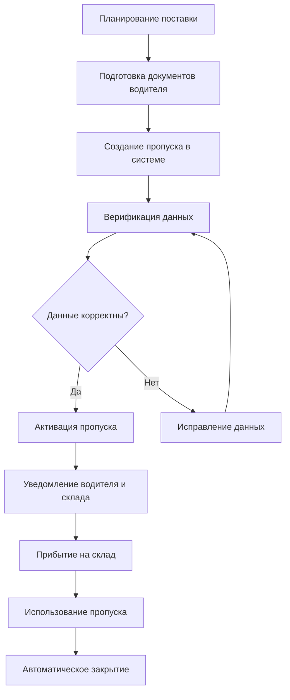

# 25. API Пропуски

**API Пропуски** - Управление пропусками прибытия и доступом к складу для OZON Seller API.

## Обзор

API Пропуски предоставляет полный контроль доступа к складам через цифровые пропуски прибытия. Этот специализированный API управляет авторизацией транспортных средств и водителей как для обычных поставок, так и для обработки возвратов. Включает 7 основных методов для управления пропусками перевозки, операциями возврата и контролем доступа.

### Ключевые возможности
- **Пропуски для перевозок**: Авторизация транспорта для регулярных поставок
- **Пропуски для возвратов**: Специальные пропуски для обработки возврата товаров
- **Верификация водителей**: Проверка водительских удостоверений и документов
- **Контроль доступа**: Безопасность склада и управление въездом
- **Управление расписанием**: Координация времени прибытия и бронирование слотов
- **Отслеживание статуса**: Мониторинг статуса пропусков в реальном времени

### Типы пропусков
- **Carriage Pass**: Пропуски для доставки товаров на склад
- **Return Pass**: Пропуски для возврата товаров со склада
- **Временные пропуски**: С указанием даты и времени прибытия
- **Постоянные пропуски**: Для регулярных поставщиков

---

## 📊 Методы API

### 🚚 Пропуски для перевозок

#### 1. **createCarriagePass** - Создание пропуска для перевозки
Создаёт пропуски для доставки товаров на склад. Идентификатор созданного пропуска добавится к перевозке.

```typescript
async createCarriagePass(
  request: PassCreateCarriagePassRequest,
  options?: RequestOptions
): Promise<PassCreateCarriagePassResponse>
```

**Параметры запроса:**
```typescript
interface PassCreateCarriagePassRequest {
  carriage_id: number;                      // ID перевозки (обязательно)
  arrival_passes: Array<{
    vehicle_number: string;                 // Номер транспортного средства
    driver_name: string;                    // ФИО водителя
    driver_license: string;                 // Номер водительского удостоверения
    arrival_date: string;                   // Дата и время прибытия (ISO 8601)
    comment?: string;                       // Комментарий к пропуску
  }>;
}
```

**Интерфейс ответа:**
```typescript
interface PassCreateCarriagePassResponse {
  arrival_pass_ids?: string[];              // Массив ID созданных пропусков
}
```

#### 2. **updateCarriagePass** - Обновление пропуска для перевозки
Обновляет информацию о существующих пропусках для перевозки.

```typescript
async updateCarriagePass(
  request: PassUpdateCarriagePassRequest,
  options?: RequestOptions
): Promise<void>
```

**Параметры запроса:**
```typescript
interface PassUpdateCarriagePassRequest {
  carriage_id: number;                      // ID перевозки
  arrival_passes: Array<{
    arrival_pass_id: string;                // ID обновляемого пропуска (обязательно)
    vehicle_number?: string;                // Новый номер ТС
    driver_name?: string;                   // Новое ФИО водителя
    driver_license?: string;                // Новый номер удостоверения
    arrival_date?: string;                  // Новые дата и время прибытия
    comment?: string;                       // Обновленный комментарий
  }>;
}
```

#### 3. **deleteCarriagePass** - Удаление пропуска для перевозки
Удаляет указанные пропуски для перевозки.

```typescript
async deleteCarriagePass(
  request: PassDeleteCarriagePassRequest,
  options?: RequestOptions
): Promise<void>
```

**Параметры запроса:**
```typescript
interface PassDeleteCarriagePassRequest {
  carriage_id: number;                      // ID перевозки
  arrival_pass_ids: string[];               // Массив ID пропусков для удаления
}
```

### 📋 Получение информации

#### 4. **getPassList** - Список пропусков
Возвращает список пропусков с возможностью фильтрации и пагинации.

```typescript
async getPassList(
  request: PassListRequest,
  options?: RequestOptions
): Promise<PassListResponse>
```

**Параметры запроса:**
```typescript
interface PassListRequest {
  limit?: number;                           // Количество записей (по умолчанию 100)
  cursor?: string;                          // Курсор для пагинации
  filter?: {
    carriage_id?: number;                   // Фильтр по ID перевозки
    status?: PassStatus;                    // Фильтр по статусу пропуска
    date_from?: string;                     // Дата начала периода
    date_to?: string;                       // Дата окончания периода
    arrival_reason?: ArrivalReason;         // Причина прибытия
    only_active_passes?: boolean;           // Только активные пропуски
    warehouse_ids?: string[];               // Фильтр по складам
  };
}

type PassStatus = 'ACTIVE' | 'EXPIRED' | 'CANCELLED' | 'USED';
type ArrivalReason = 'FBS_DELIVERY' | 'FBO_DELIVERY' | 'RETURN' | 'OTHER';
```

**Интерфейс ответа:**
```typescript
interface PassListResponse {
  arrival_passes?: Array<{
    arrival_pass_id: string;                // ID пропуска
    carriage_id?: number;                   // ID перевозки
    vehicle_number: string;                 // Номер ТС
    driver_name: string;                    // ФИО водителя
    driver_license: string;                 // Номер удостоверения
    arrival_date: string;                   // Дата и время прибытия
    status: PassStatus;                     // Статус пропуска
    arrival_reason?: ArrivalReason;         // Причина прибытия
    warehouse_id?: string;                  // ID склада
    comment?: string;                       // Комментарий
    created_at?: string;                    // Дата создания
    updated_at?: string;                    // Дата обновления
  }>;
  cursor?: string;                          // Курсор для следующей страницы
  total_count?: number;                     // Общее количество пропусков
}
```

### 🔄 Пропуски для возвратов

#### 5. **createReturnPass** - Создание пропуска для возврата
Создаёт пропуски для возврата товаров со склада.

```typescript
async createReturnPass(
  request: PassCreateReturnPassRequest,
  options?: RequestOptions
): Promise<PassCreateReturnPassResponse>
```

**Параметры запроса:**
```typescript
interface PassCreateReturnPassRequest {
  arrival_passes: Array<{
    vehicle_number: string;                 // Номер транспортного средства
    driver_name: string;                    // ФИО водителя
    driver_license: string;                 // Номер водительского удостоверения
    arrival_date: string;                   // Дата и время прибытия
    posting_number: string;                 // Номер отправления для возврата
    comment?: string;                       // Комментарий к пропуску возврата
  }>;
}
```

#### 6. **updateReturnPass** - Обновление пропуска для возврата
Обновляет информацию о пропусках для возврата.

```typescript
async updateReturnPass(
  request: PassUpdateReturnPassRequest,
  options?: RequestOptions
): Promise<void>
```

**Параметры запроса:**
```typescript
interface PassUpdateReturnPassRequest {
  arrival_passes: Array<{
    arrival_pass_id: string;                // ID обновляемого пропуска возврата
    vehicle_number?: string;                // Обновленный номер ТС
    driver_name?: string;                   // Обновленное ФИО водителя
    driver_license?: string;                // Обновленный номер удостоверения
    arrival_date?: string;                  // Обновленные дата и время прибытия
    posting_number?: string;                // Обновленный номер отправления
    comment?: string;                       // Обновленный комментарий
  }>;
}
```

#### 7. **deleteReturnPass** - Удаление пропуска для возврата
Удаляет указанные пропуски для возврата.

```typescript
async deleteReturnPass(
  request: PassDeleteReturnPassRequest,
  options?: RequestOptions
): Promise<void>
```

**Параметры запроса:**
```typescript
interface PassDeleteReturnPassRequest {
  arrival_pass_ids: string[];               // Массив ID пропусков возврата для удаления
}
```

---

## 🚀 Практические примеры

### Комплексный пример управления пропусками

```typescript
import { OzonSellerAPI } from 'daytona-ozon-seller-api';

const api = new OzonSellerAPI({
  clientId: 'ваш-client-id',
  apiKey: 'ваш-api-key'
});

// Полный рабочий процесс управления пропусками
async function completePassManagement() {
  console.log('🚚 Запуск системы управления пропусками...');

  // 1. Создание пропуска для перевозки
  console.log('📝 Создание пропусков для поставки товаров...');
  
  const carriagePass = await api.pass.createCarriagePass({
    carriage_id: 12345,
    arrival_passes: [{
      vehicle_number: 'А123БВ777',
      driver_name: 'Иванов Иван Иванович',
      driver_license: '12 34 567890',
      arrival_date: '2024-01-15T09:00:00Z',
      comment: 'Плановая поставка электроники'
    }, {
      vehicle_number: 'Б456ГД888',
      driver_name: 'Петров Петр Петрович',
      driver_license: '98 76 543210',
      arrival_date: '2024-01-15T14:00:00Z',
      comment: 'Дополнительная поставка одежды'
    }]
  });

  console.log(`✅ Создано пропусков: ${carriagePass.arrival_pass_ids?.length}`);
  carriagePass.arrival_pass_ids?.forEach((id, index) => {
    console.log(`   🎫 Пропуск ${index + 1}: ${id}`);
  });

  // 2. Создание пропуска для возврата
  console.log('🔄 Создание пропуска для возврата товаров...');
  
  const returnPass = await api.pass.createReturnPass({
    arrival_passes: [{
      vehicle_number: 'С789ЖЗ111',
      driver_name: 'Сидоров Сидор Сидорович',
      driver_license: '55 66 778899',
      arrival_date: '2024-01-16T11:00:00Z',
      posting_number: '12345-0001-1',
      comment: 'Возврат бракованных товаров'
    }]
  });

  console.log(`✅ Создано пропусков возврата: ${returnPass.arrival_pass_ids?.length}`);

  // 3. Получение списка всех пропусков
  console.log('📋 Получение списка пропусков...');
  
  const passList = await api.pass.getPassList({
    limit: 100,
    filter: {
      carriage_id: 12345,
      status: 'ACTIVE',
      date_from: '2024-01-15T00:00:00Z',
      date_to: '2024-01-16T23:59:59Z'
    }
  });

  console.log(`📊 Найдено активных пропусков: ${passList.arrival_passes?.length}`);

  // Анализ пропусков
  if (passList.arrival_passes && passList.arrival_passes.length > 0) {
    console.log('\n📈 Анализ пропусков:');
    
    passList.arrival_passes.forEach((pass, index) => {
      console.log(`\n🎫 Пропуск ${index + 1}:`);
      console.log(`   ID: ${pass.arrival_pass_id}`);
      console.log(`   🚛 Автомобиль: ${pass.vehicle_number}`);
      console.log(`   👤 Водитель: ${pass.driver_name}`);
      console.log(`   📄 Удостоверение: ${pass.driver_license}`);
      console.log(`   📅 Прибытие: ${new Date(pass.arrival_date).toLocaleString('ru-RU')}`);
      console.log(`   ⭐ Статус: ${pass.status}`);
      if (pass.comment) {
        console.log(`   💬 Комментарий: ${pass.comment}`);
      }
    });
  }

  // 4. Обновление пропуска при изменении времени
  if (carriagePass.arrival_pass_ids && carriagePass.arrival_pass_ids.length > 0) {
    const firstPassId = carriagePass.arrival_pass_ids[0];
    
    console.log('\n🔧 Обновление времени прибытия...');
    await api.pass.updateCarriagePass({
      carriage_id: 12345,
      arrival_passes: [{
        arrival_pass_id: firstPassId,
        arrival_date: '2024-01-15T10:30:00Z', // Изменили время на 10:30
        comment: 'Время прибытия изменено по просьбе водителя'
      }]
    });
    
    console.log(`✅ Пропуск ${firstPassId} успешно обновлён`);
  }

  return {
    carriagePassIds: carriagePass.arrival_pass_ids,
    returnPassIds: returnPass.arrival_pass_ids,
    totalActivePasses: passList.arrival_passes?.length || 0
  };
}
```

### Мониторинг пропусков в реальном времени

```typescript
// Система мониторинга пропусков
class PassMonitoring {
  constructor(private api: OzonSellerAPI) {}

  async monitorDailyPasses(): Promise<PassAnalytics> {
    const today = new Date();
    const todayStart = new Date(today.setHours(0, 0, 0, 0)).toISOString();
    const todayEnd = new Date(today.setHours(23, 59, 59, 999)).toISOString();

    console.log(`📊 Мониторинг пропусков за ${today.toLocaleDateString('ru-RU')}`);

    // Получаем все пропуски за сегодня
    const allPasses = await this.getAllPassesForPeriod(todayStart, todayEnd);
    
    // Анализируем данные
    const analytics = this.analyzePassData(allPasses);
    
    // Генерируем предупреждения
    const alerts = this.generateAlerts(analytics);
    
    // Выводим отчёт
    this.printDailyReport(analytics, alerts);
    
    return analytics;
  }

  private async getAllPassesForPeriod(dateFrom: string, dateTo: string) {
    const allPasses = [];
    let cursor: string | undefined;

    do {
      const response = await this.api.pass.getPassList({
        limit: 1000,
        cursor,
        filter: {
          date_from: dateFrom,
          date_to: dateTo
        }
      });

      if (response.arrival_passes) {
        allPasses.push(...response.arrival_passes);
      }

      cursor = response.cursor;
    } while (cursor);

    return allPasses;
  }

  private analyzePassData(passes: any[]): PassAnalytics {
    const statusCount = this.countByStatus(passes);
    const timeSlots = this.analyzeTimeSlots(passes);
    const carriageStats = this.analyzeCarriages(passes);

    return {
      totalPasses: passes.length,
      statusBreakdown: statusCount,
      timeSlotAnalysis: timeSlots,
      carriageAnalysis: carriageStats,
      peakHours: this.identifyPeakHours(timeSlots)
    };
  }

  private countByStatus(passes: any[]): Record<string, number> {
    return passes.reduce((acc, pass) => {
      const status = pass.status || 'UNKNOWN';
      acc[status] = (acc[status] || 0) + 1;
      return acc;
    }, {});
  }

  private analyzeTimeSlots(passes: any[]) {
    const hourSlots = new Array(24).fill(0);
    
    passes.forEach(pass => {
      if (pass.arrival_date) {
        const hour = new Date(pass.arrival_date).getHours();
        hourSlots[hour]++;
      }
    });

    return hourSlots.map((count, hour) => ({
      hour,
      count,
      timeSlot: `${hour}:00-${hour + 1}:00`
    }));
  }

  private analyzeCarriages(passes: any[]) {
    const carriages = passes.reduce((acc, pass) => {
      if (pass.carriage_id) {
        const carriageId = pass.carriage_id.toString();
        if (!acc[carriageId]) {
          acc[carriageId] = {
            id: carriageId,
            passCount: 0,
            drivers: new Set(),
            vehicles: new Set()
          };
        }
        acc[carriageId].passCount++;
        if (pass.driver_name) acc[carriageId].drivers.add(pass.driver_name);
        if (pass.vehicle_number) acc[carriageId].vehicles.add(pass.vehicle_number);
      }
      return acc;
    }, {});

    // Конвертируем Set в массивы для сериализации
    Object.values(carriages).forEach((carriage: any) => {
      carriage.drivers = Array.from(carriage.drivers);
      carriage.vehicles = Array.from(carriage.vehicles);
    });

    return Object.values(carriages);
  }

  private identifyPeakHours(timeSlots: any[]): string[] {
    const maxCount = Math.max(...timeSlots.map(slot => slot.count));
    return timeSlots
      .filter(slot => slot.count === maxCount && slot.count > 0)
      .map(slot => slot.timeSlot);
  }

  private generateAlerts(analytics: PassAnalytics): PassAlert[] {
    const alerts: PassAlert[] = [];

    // Предупреждение о высокой загрузке
    if (analytics.totalPasses > 100) {
      alerts.push({
        type: 'HIGH_VOLUME',
        severity: 'MEDIUM',
        message: `Высокая загрузка: ${analytics.totalPasses} пропусков за день`,
        action: 'Рассмотреть оптимизацию временных слотов'
      });
    }

    // Предупреждение об истекших пропусках
    const expiredCount = analytics.statusBreakdown['EXPIRED'] || 0;
    if (expiredCount > analytics.totalPasses * 0.1) {
      alerts.push({
        type: 'HIGH_EXPIRED_RATE',
        severity: 'HIGH',
        message: `Высокий процент истекших пропусков: ${expiredCount} (${((expiredCount / analytics.totalPasses) * 100).toFixed(1)}%)`,
        action: 'Проверить процесс оформления и использования пропусков'
      });
    }

    // Предупреждение о пиковых часах
    if (analytics.peakHours.length > 0) {
      const maxLoad = Math.max(...analytics.timeSlotAnalysis.map(slot => slot.count));
      if (maxLoad > 10) {
        alerts.push({
          type: 'PEAK_HOURS_OVERLOAD',
          severity: 'MEDIUM',
          message: `Перегрузка в пиковые часы: ${analytics.peakHours.join(', ')} (${maxLoad} пропусков/час)`,
          action: 'Рассмотреть распределение нагрузки по времени'
        });
      }
    }

    return alerts;
  }

  private printDailyReport(analytics: PassAnalytics, alerts: PassAlert[]) {
    console.log('\n📊 ЕЖЕДНЕВНЫЙ ОТЧЁТ ПО ПРОПУСКАМ');
    console.log('=====================================');
    
    console.log(`📈 Общее количество пропусков: ${analytics.totalPasses}`);
    
    console.log('\n📋 Распределение по статусам:');
    Object.entries(analytics.statusBreakdown).forEach(([status, count]) => {
      const percentage = ((count / analytics.totalPasses) * 100).toFixed(1);
      console.log(`   ${status}: ${count} (${percentage}%)`);
    });

    console.log('\n⏰ Пиковые часы:');
    if (analytics.peakHours.length > 0) {
      analytics.peakHours.forEach(hour => {
        console.log(`   🔥 ${hour}`);
      });
    } else {
      console.log('   Пиковых часов не выявлено');
    }

    console.log('\n🚛 Статистика по перевозкам:');
    analytics.carriageAnalysis.forEach((carriage: any) => {
      console.log(`   Перевозка ${carriage.id}:`);
      console.log(`     Пропусков: ${carriage.passCount}`);
      console.log(`     Водителей: ${carriage.drivers.length}`);
      console.log(`     Транспорта: ${carriage.vehicles.length}`);
    });

    if (alerts.length > 0) {
      console.log('\n⚠️ ПРЕДУПРЕЖДЕНИЯ:');
      alerts.forEach(alert => {
        const severityIcon = {
          'LOW': '💡',
          'MEDIUM': '⚠️',
          'HIGH': '🚨',
          'CRITICAL': '🔥'
        }[alert.severity];
        
        console.log(`   ${severityIcon} ${alert.type}: ${alert.message}`);
        console.log(`     Действие: ${alert.action}`);
      });
    } else {
      console.log('\n✅ Предупреждений нет - система работает нормально');
    }
  }
}

interface PassAnalytics {
  totalPasses: number;
  statusBreakdown: Record<string, number>;
  timeSlotAnalysis: Array<{
    hour: number;
    count: number;
    timeSlot: string;
  }>;
  carriageAnalysis: Array<{
    id: string;
    passCount: number;
    drivers: string[];
    vehicles: string[];
  }>;
  peakHours: string[];
}

interface PassAlert {
  type: string;
  severity: 'LOW' | 'MEDIUM' | 'HIGH' | 'CRITICAL';
  message: string;
  action: string;
}
```

### Автоматизация управления пропусками

```typescript
// Автоматизированная система управления пропусками
class AutomatedPassManager {
  constructor(private api: OzonSellerAPI) {}

  async autoCreatePassesForScheduledDeliveries(): Promise<void> {
    console.log('🤖 Запуск автоматического создания пропусков...');
    
    // Получаем запланированные поставки на завтра
    const tomorrow = new Date();
    tomorrow.setDate(tomorrow.getDate() + 1);
    
    const scheduledDeliveries = await this.getScheduledDeliveries(tomorrow);
    
    for (const delivery of scheduledDeliveries) {
      try {
        await this.createPassForDelivery(delivery);
        console.log(`✅ Пропуск создан для поставки ${delivery.carriageId}`);
      } catch (error) {
        console.error(`❌ Ошибка создания пропуска для поставки ${delivery.carriageId}:`, error);
      }
    }
    
    console.log(`🎯 Завершено: обработано ${scheduledDeliveries.length} поставок`);
  }

  private async getScheduledDeliveries(date: Date): Promise<ScheduledDelivery[]> {
    // В реальном приложении это будет запрос к системе планирования
    return [
      {
        carriageId: 12345,
        driverName: 'Иванов Иван Иванович',
        driverLicense: '12 34 567890',
        vehicleNumber: 'А123БВ777',
        plannedArrival: new Date(date.setHours(9, 0, 0, 0)).toISOString(),
        deliveryType: 'electronics'
      },
      {
        carriageId: 12346,
        driverName: 'Петров Петр Петрович', 
        driverLicense: '98 76 543210',
        vehicleNumber: 'Б456ГД888',
        plannedArrival: new Date(date.setHours(14, 0, 0, 0)).toISOString(),
        deliveryType: 'clothing'
      }
    ];
  }

  private async createPassForDelivery(delivery: ScheduledDelivery): Promise<void> {
    await this.api.pass.createCarriagePass({
      carriage_id: delivery.carriageId,
      arrival_passes: [{
        vehicle_number: delivery.vehicleNumber,
        driver_name: delivery.driverName,
        driver_license: delivery.driverLicense,
        arrival_date: delivery.plannedArrival,
        comment: `Автоматически созданный пропуск для поставки ${delivery.deliveryType}`
      }]
    });
  }

  async cleanupExpiredPasses(): Promise<void> {
    console.log('🧹 Очистка истекших пропусков...');
    
    const yesterday = new Date();
    yesterday.setDate(yesterday.getDate() - 1);
    
    const expiredPasses = await this.api.pass.getPassList({
      limit: 1000,
      filter: {
        status: 'EXPIRED',
        date_to: yesterday.toISOString()
      }
    });

    if (expiredPasses.arrival_passes && expiredPasses.arrival_passes.length > 0) {
      // Группируем по carriage_id для массового удаления
      const passesToDelete = this.groupPassesByCarriage(expiredPasses.arrival_passes);
      
      for (const [carriageId, passIds] of passesToDelete.entries()) {
        try {
          await this.api.pass.deleteCarriagePass({
            carriage_id: parseInt(carriageId),
            arrival_pass_ids: passIds
          });
          console.log(`🗑️ Удалено ${passIds.length} истекших пропусков для перевозки ${carriageId}`);
        } catch (error) {
          console.error(`❌ Ошибка удаления пропусков для перевозки ${carriageId}:`, error);
        }
      }
    } else {
      console.log('✨ Истекших пропусков для удаления не найдено');
    }
  }

  private groupPassesByCarriage(passes: any[]): Map<string, string[]> {
    const grouped = new Map<string, string[]>();
    
    passes.forEach(pass => {
      if (pass.carriage_id && pass.arrival_pass_id) {
        const carriageId = pass.carriage_id.toString();
        
        if (!grouped.has(carriageId)) {
          grouped.set(carriageId, []);
        }
        
        grouped.get(carriageId)!.push(pass.arrival_pass_id);
      }
    });
    
    return grouped;
  }
}

interface ScheduledDelivery {
  carriageId: number;
  driverName: string;
  driverLicense: string;
  vehicleNumber: string;
  plannedArrival: string;
  deliveryType: string;
}
```

---

## 🔄 Бизнес-процессы

### Стандартный процесс создания пропуска


### Точки интеграции
1. **Система планирования** → Автоматическое создание пропусков для запланированных поставок
2. **CRM система** → Управление базой данных водителей и транспортных средств
3. **Система безопасности склада** → Верификация пропусков при въезде
4. **Уведомления** → SMS/email оповещения водителей о статусе пропусков
5. **Аналитические системы** → Отчёты о загрузке складов и оптимизации логистики

---

## 📊 Структуры данных

### Статусы пропусков
```typescript
type PassStatus = 
  | 'ACTIVE'         // Активный пропуск, готов к использованию
  | 'EXPIRED'        // Истёкший пропуск, требует обновления
  | 'CANCELLED'      // Отмененный пропуск
  | 'USED';          // Использованный пропуск
```

### Причины прибытия
```typescript
type ArrivalReason = 
  | 'FBS_DELIVERY'   // Поставка по схеме FBS
  | 'FBO_DELIVERY'   // Поставка по схеме FBO
  | 'RETURN'         // Возврат товаров
  | 'OTHER';         // Прочие причины
```

### Полная структура пропуска
```typescript
interface ArrivalPass {
  arrival_pass_id: string;                  // Уникальный ID пропуска
  carriage_id?: number;                     // ID перевозки (для пропусков доставки)
  vehicle_number: string;                   // Номер транспортного средства
  driver_name: string;                      // ФИО водителя
  driver_license: string;                   // Номер водительского удостоверения
  arrival_date: string;                     // Плановые дата и время прибытия
  status: PassStatus;                       // Текущий статус пропуска
  arrival_reason?: ArrivalReason;           // Причина прибытия
  warehouse_id?: string;                    // ID целевого склада
  posting_number?: string;                  // Номер отправления (для возвратов)
  comment?: string;                         // Комментарий к пропуску
  
  // Системная информация
  created_at?: string;                      // Дата и время создания пропуска
  updated_at?: string;                      // Дата и время последнего обновления
  created_by?: string;                      // Пользователь, создавший пропуск
  used_at?: string;                         // Дата и время использования пропуска
  
  // Дополнительная информация для безопасности
  driver_phone?: string;                    // Телефон водителя
  vehicle_model?: string;                   // Модель транспортного средства
  cargo_description?: string;               // Описание груза
}
```

---

## ⚠️ Важные особенности

### Бизнес-правила
- **Время действия пропуска**: Пропуск действителен только в указанную дату и время
- **Верификация водителя**: Обязательная проверка водительского удостоверения
- **Уникальность ТС**: Один номер транспортного средства не может иметь несколько активных пропусков
- **Ограничения склада**: Каждый пропуск привязан к конкретному складу

### Технические ограничения
- **Количество пропусков**: До 100 пропусков за один запрос создания
- **Время создания**: Пропуск должен создаваться не менее чем за 2 часа до прибытия
- **Срок действия**: Пропуск автоматически истекает через 24 часа после указанного времени
- **Пагинация**: Список пропусков поддерживает курсорную пагинацию

### Рекомендации по использованию
- **Автоматизация**: Настройка автоматического создания пропусков для регулярных поставок
- **Мониторинг**: Ежедневная проверка истекших и неиспользованных пропусков
- **Резервирование**: Создание резервных временных слотов для экстренных поставок
- **Интеграция с безопасностью**: Связка с системами контроля доступа на складе

---

**Статус реализации**: ✅ Завершено  
**Последнее обновление**: 2024  
**Версия API**: v1  
**Количество методов**: 7 методов управления пропусками