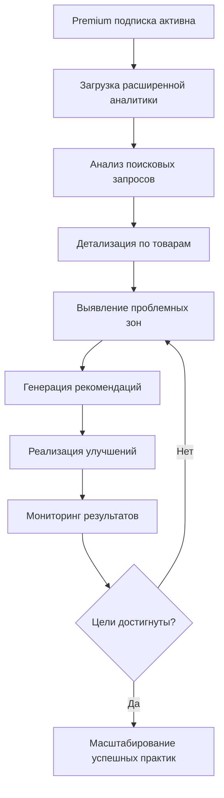
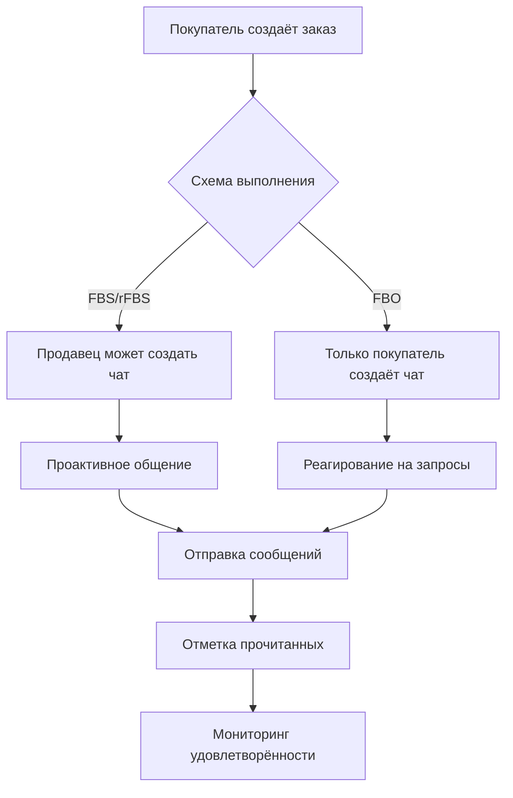

# 26. API Premium

**API Premium** - Премиальные функции и расширенная аналитика для продавцов с подписками Premium и Premium Plus в OZON Seller API.

## Обзор

API Premium предоставляет доступ к расширенным возможностям и эксклюзивным функциям для продавцов с активными подписками Premium или Premium Plus. Этот специализированный API включает 8 методов, разделённых на категории аналитики, чатов с покупателями и финансовых отчётов. Большинство методов требуют подписку Premium Plus для обеспечения максимальной функциональности.

### Ключевые возможности
- **Расширенная аналитика**: Глубокая аналитика с неограниченными историческими данными
- **Анализ поисковых запросов**: Детальная информация о том, как покупатели находят ваши товары
- **Прямое общение с покупателями**: Чаты для повышения уровня сервиса
- **Ежедневная финансовая отчётность**: Детализированные отчёты о реализации
- **Премиум метрики**: Эксклюзивные показатели эффективности

### Уровни подписок
- **Premium**: Базовые премиальные функции аналитики
- **Premium Plus**: Полный доступ ко всем функциям, включая чаты и ежедневную отчётность

---

## 📊 Методы API

### 📈 Аналитические данные

#### 1. **getAnalyticsData** - Данные аналитики (Premium Plus)
Получение расширенных аналитических данных с группировкой по различным измерениям и метрикам.

```typescript
async getAnalyticsData(
  request: PremiumAnalyticsGetDataRequest,
  options?: RequestOptions
): Promise<PremiumAnalyticsGetDataResponse>
```

**⚠️ Требует подписку Premium Plus**

**Ограничения:**
- Использование не более 1 раза в минуту
- Для продавцов без подписки доступны только данные за последние 3 месяца
- С подпиской Premium Plus ограничений нет

**Параметры запроса:**
```typescript
interface PremiumAnalyticsGetDataRequest {
  date_from: string;                        // Дата начала периода (YYYY-MM-DD)
  date_to: string;                          // Дата окончания периода (YYYY-MM-DD)
  dimension: AnalyticsDimension[];          // Измерения для группировки данных
  metrics: AnalyticsMetric[];               // Метрики для расчёта
  limit?: number;                           // Лимит записей (по умолчанию 1000)
  offset?: number;                          // Смещение для пагинации
  filters?: Array<{                         // Фильтры для данных
    field: string;                          // Поле для фильтрации
    values: string[];                       // Значения фильтра
  }>;
  sort?: Array<{                           // Сортировка результатов
    field: string;                          // Поле для сортировки
    direction: 'ASC' | 'DESC';              // Направление сортировки
  }>;
}

// Доступные измерения
type AnalyticsDimension = 
  | 'sku'              // По товарам (SKU)
  | 'day'              // По дням
  | 'week'             // По неделям
  | 'month'            // По месяцам
  | 'category1'        // По категориям уровня 1
  | 'category2'        // По категориям уровня 2
  | 'category3'        // По категориям уровня 3
  | 'brand'            // По брендам
  | 'warehouse'        // По складам
  | 'region';          // По регионам

// Доступные метрики
type AnalyticsMetric = 
  | 'revenue'          // Выручка
  | 'ordered_units'    // Заказанные единицы
  | 'hits_view'        // Просмотры
  | 'hits_tocart'      // Добавления в корзину
  | 'session_view'     // Просмотры сессий
  | 'conv_tocart'      // Конверсия в корзину
  | 'returns'          // Возвраты
  | 'cancellations'    // Отмены
  | 'revenue_return'   // Выручка с возвратов
  | 'position_category'; // Средняя позиция в категории
```

**Интерфейс ответа:**
```typescript
interface PremiumAnalyticsGetDataResponse {
  result?: {
    data?: Array<{
      dimensions?: Record<AnalyticsDimension, string>; // Значения измерений
      metrics?: Record<AnalyticsMetric, number>;       // Значения метрик
    }>;
    totals?: Record<AnalyticsMetric, number>;          // Общие итоги по метрикам
  };
  timestamp?: string;                                  // Временная метка данных
}
```

### 🔍 Поисковая аналитика

#### 2. **getProductQueries** - Запросы товаров (Premium/Premium Plus)
Получение информации о поисковых запросах, по которым находят ваши товары.

```typescript
async getProductQueries(
  request: PremiumProductQueriesRequest,
  options?: RequestOptions
): Promise<PremiumProductQueriesResponse>
```

**⚠️ Требует подписку Premium или Premium Plus**

**Параметры запроса:**
```typescript
interface PremiumProductQueriesRequest {
  date_from?: string;                       // Дата начала периода
  date_to?: string;                         // Дата окончания периода
  skus?: string[];                          // Список SKU для анализа
  page_size?: number;                       // Размер страницы (по умолчанию 50)
  page_token?: string;                      // Токен для пагинации
  sort_by?: QuerySortField;                 // Поле для сортировки
  sort_dir?: 'ASC' | 'DESC';               // Направление сортировки
}

type QuerySortField = 
  | 'queries_count'    // По количеству запросов
  | 'ctr'              // По CTR (Click Through Rate)
  | 'shows_count'      // По количеству показов
  | 'clicks_count';    // По количеству кликов
```

**Интерфейс ответа:**
```typescript
interface PremiumProductQueriesResponse {
  items?: Array<{
    sku: string;                            // SKU товара
    queries_count: number;                  // Количество уникальных запросов
    shows_count: number;                    // Общее количество показов
    clicks_count: number;                   // Общее количество кликов
    ctr: number;                            // CTR в процентах
    avg_position: number;                   // Средняя позиция в поиске
    conversion_rate: number;                // Конверсия в покупки
  }>;
  next_page_token?: string;                 // Токен следующей страницы
  total_count?: number;                     // Общее количество записей
}
```

#### 3. **getProductQueriesDetails** - Детализация запросов (Premium/Premium Plus)
Подробная информация о конкретных поисковых запросах для выбранных товаров.

```typescript
async getProductQueriesDetails(
  request: PremiumProductQueriesDetailsRequest,
  options?: RequestOptions
): Promise<PremiumProductQueriesDetailsResponse>
```

**Параметры запроса:**
```typescript
interface PremiumProductQueriesDetailsRequest {
  date_from?: string;                       // Дата начала периода
  date_to?: string;                         // Дата окончания периода
  skus: string[];                           // Список SKU (обязательно)
  limit_by_sku?: number;                    // Лимит запросов на SKU (по умолчанию 10)
  page_size?: number;                       // Размер страницы (по умолчанию 100)
  page_token?: string;                      // Токен для пагинации
  sort_by?: QueryDetailSortField;           // Поле для сортировки
  sort_dir?: 'ASC' | 'DESC';               // Направление сортировки
}

type QueryDetailSortField = 
  | 'clicks'           // По количеству кликов
  | 'shows'            // По количеству показов
  | 'ctr'              // По CTR
  | 'position'         // По средней позиции
  | 'query';           // По запросу (алфавитный)
```

**Интерфейс ответа:**
```typescript
interface PremiumProductQueriesDetailsResponse {
  queries?: Array<{
    sku: string;                            // SKU товара
    query: string;                          // Текст поискового запроса
    clicks: number;                         // Количество кликов по запросу
    shows: number;                          // Количество показов по запросу
    ctr: number;                            // CTR по запросу
    position: number;                       // Средняя позиция в поиске
    avg_price: number;                      // Средняя цена при показе
    query_frequency: number;                // Частота запроса (популярность)
  }>;
  next_page_token?: string;                 // Токен следующей страницы
  total_count?: number;                     // Общее количество запросов
}
```

### 💬 Чаты с покупателями

#### 4. **sendChatMessage** - Отправка сообщения (Premium Plus)
Отправка сообщения покупателю в существующий чат.

```typescript
async sendChatMessage(
  request: PremiumChatSendMessageRequest,
  options?: RequestOptions
): Promise<PremiumChatSendMessageResponse>
```

**⚠️ Требует подписку Premium Plus**

**Временные ограничения:**
- **FBO**: 48 часов с момента получения последнего сообщения от покупателя
- **FBS/rFBS**: 72 часа после доставки + 48 часов для ответов

**Параметры запроса:**
```typescript
interface PremiumChatSendMessageRequest {
  chat_id: string;                          // ID чата (обязательно)
  text: string;                             // Текст сообщения (обязательно, до 4000 символов)
  reply_to_message_id?: string;             // ID сообщения, на которое отвечаем
}
```

**Интерфейс ответа:**
```typescript
interface PremiumChatSendMessageResponse {
  result?: {
    message_id: string;                     // ID отправленного сообщения
    status: MessageStatus;                  // Статус отправки
    sent_at: string;                        // Время отправки
  };
  error?: string;                           // Ошибка при отправке
}

type MessageStatus = 'SENT' | 'DELIVERED' | 'READ' | 'FAILED';
```

#### 5. **startChat** - Создание чата (Premium Plus)
Создание нового чата с покупателем по номеру отправления.

```typescript
async startChat(
  request: PremiumChatStartRequest,
  options?: RequestOptions
): Promise<PremiumChatStartResponse>
```

**⚠️ Требует подписку Premium Plus**

**Ограничения по схемам:**
- **FBO**: Чат может создать только покупатель
- **FBS/rFBS**: Продавец может создать чат в течение 72 часов после оплаты или доставки

**Параметры запроса:**
```typescript
interface PremiumChatStartRequest {
  posting_number: string;                   // Номер отправления (обязательно)
  initial_message?: string;                 // Начальное сообщение в чате
}
```

**Интерфейс ответа:**
```typescript
interface PremiumChatStartResponse {
  result?: {
    chat_id: string;                        // ID созданного чата
    posting_number: string;                 // Номер отправления
    customer_id?: string;                   // ID покупателя
    created_at: string;                     // Время создания чата
  };
  error?: string;                           // Ошибка при создании
}
```

#### 6. **markChatAsRead** - Отметка прочитанных (Premium Plus)
Отметка сообщений чата как прочитанных.

```typescript
async markChatAsRead(
  request: PremiumChatReadRequest,
  options?: RequestOptions
): Promise<PremiumChatReadResponse>
```

**Параметры запроса:**
```typescript
interface PremiumChatReadRequest {
  chat_id: string;                          // ID чата (обязательно)
  message_id: string;                       // ID последнего прочитанного сообщения
}
```

#### 7. **getChatHistory** - История чата (Premium Plus)
Получение истории сообщений в чате с покупателем.

```typescript
async getChatHistory(
  request: PremiumChatHistoryRequest,
  options?: RequestOptions
): Promise<PremiumChatHistoryResponse>
```

**Параметры запроса:**
```typescript
interface PremiumChatHistoryRequest {
  chat_id: string;                          // ID чата (обязательно)
  limit?: number;                           // Количество сообщений (по умолчанию 50)
  offset?: number;                          // Смещение от начала истории
  order?: 'ASC' | 'DESC';                  // Порядок сообщений (по умолчанию DESC)
}
```

**Интерфейс ответа:**
```typescript
interface PremiumChatHistoryResponse {
  messages?: Array<{
    message_id: string;                     // ID сообщения
    author: 'SELLER' | 'CUSTOMER' | 'SYSTEM'; // Автор сообщения
    text: string;                           // Текст сообщения
    created_at: string;                     // Время создания
    status: MessageStatus;                  // Статус сообщения
    reply_to_message_id?: string;           // ID сообщения, на которое отвечают
  }>;
  total_count?: number;                     // Общее количество сообщений в чате
  chat_status: ChatStatus;                  // Текущий статус чата
}

type ChatStatus = 'ACTIVE' | 'CLOSED' | 'BLOCKED';
```

### 📊 Финансовые отчёты

#### 8. **getRealizationByDay** - Ежедневный отчёт реализации (Premium Plus)
Получение детального отчёта о реализации товаров за конкретный день.

```typescript
async getRealizationByDay(
  request: PremiumRealizationByDayRequest,
  options?: RequestOptions
): Promise<PremiumRealizationByDayResponse>
```

**⚠️ Требует подписку Premium Plus**

**Ограничения:**
- Данные доступны не более чем за 32 календарных дня от текущей даты
- Отмены и невыкупы не включаются

**Параметры запроса:**
```typescript
interface PremiumRealizationByDayRequest {
  day: number;                              // День месяца (1-31)
  month: number;                            // Месяц (1-12)
  year: number;                             // Год (YYYY)
}
```

**Интерфейс ответа:**
```typescript
interface PremiumRealizationByDayResponse {
  rows?: Array<{
    name: string;                           // Название показателя
    quantity: number;                       // Количество единиц
    amount: number;                         // Сумма
    currency: string;                       // Валюта (RUB)
    percentage?: number;                    // Процент от общей суммы
  }>;
  totals?: {
    total_quantity: number;                 // Общее количество
    total_amount: number;                   // Общая сумма
    currency: string;                       // Валюта итогов
  };
  report_date: string;                      // Дата отчёта
  generated_at: string;                     // Время генерации отчёта
}
```

---

## 🚀 Практические примеры

### Комплексная премиальная аналитика

```typescript
import { OzonSellerAPI } from 'daytona-ozon-seller-api';

const api = new OzonSellerAPI({
  clientId: 'ваш-client-id',
  apiKey: 'ваш-api-key'
});

// Комплексный анализ эффективности товаров (Premium Plus)
async function comprehensiveProductAnalysis() {
  console.log('📊 Запуск комплексного анализа Premium функций...');

  // 1. Получение расширенной аналитики за месяц
  console.log('📈 Загрузка расширенной аналитики...');
  
  const analyticsData = await api.premium.getAnalyticsData({
    date_from: '2024-01-01',
    date_to: '2024-01-31',
    dimension: ['sku', 'week'],
    metrics: ['revenue', 'ordered_units', 'hits_view', 'conv_tocart', 'returns'],
    limit: 500,
    filters: [{
      field: 'category1',
      values: ['Electronics', 'Clothing']
    }],
    sort: [{
      field: 'revenue',
      direction: 'DESC'
    }]
  });

  // 2. Анализ поисковых запросов
  console.log('🔍 Анализ поисковых запросов...');
  
  const topSkus = analyticsData.result?.data
    ?.slice(0, 10)
    ?.map(item => item.dimensions?.sku)
    ?.filter(Boolean) as string[];

  const productQueries = await api.premium.getProductQueries({
    date_from: '2024-01-01',
    date_to: '2024-01-31',
    skus: topSkus,
    page_size: 100,
    sort_by: 'ctr',
    sort_dir: 'DESC'
  });

  // 3. Детальный анализ запросов для топ-товаров
  const queryDetails = await api.premium.getProductQueriesDetails({
    date_from: '2024-01-01',
    date_to: '2024-01-31',
    skus: topSkus.slice(0, 5), // Топ-5 товаров
    limit_by_sku: 20,
    page_size: 100,
    sort_by: 'clicks',
    sort_dir: 'DESC'
  });

  // 4. Ежедневная отчётность за последнюю неделю
  console.log('📊 Загрузка ежедневных отчётов...');
  
  const dailyReports = [];
  for (let i = 1; i <= 7; i++) {
    const reportDate = new Date();
    reportDate.setDate(reportDate.getDate() - i);
    
    try {
      const dailyReport = await api.premium.getRealizationByDay({
        day: reportDate.getDate(),
        month: reportDate.getMonth() + 1,
        year: reportDate.getFullYear()
      });
      
      dailyReports.push({
        date: reportDate.toISOString().split('T')[0],
        data: dailyReport
      });
    } catch (error) {
      console.warn(`⚠️ Данные за ${reportDate.toISOString().split('T')[0]} недоступны`);
    }
  }

  // Анализ и вывод результатов
  console.log('\n🎯 РЕЗУЛЬТАТЫ ПРЕМИАЛЬНОГО АНАЛИЗА');
  console.log('=====================================');

  // Топ-товары по выручке
  console.log('\n💰 Топ-товары по выручке:');
  analyticsData.result?.data?.slice(0, 10).forEach((item, index) => {
    console.log(`${index + 1}. SKU: ${item.dimensions?.sku}`);
    console.log(`   Выручка: ${item.metrics?.revenue} ₽`);
    console.log(`   Заказы: ${item.metrics?.ordered_units} шт.`);
    console.log(`   Конверсия в корзину: ${item.metrics?.conv_tocart?.toFixed(2)}%`);
  });

  // Анализ поисковых запросов
  console.log('\n🔍 Анализ поисковой эффективности:');
  productQueries.items?.slice(0, 5).forEach((item, index) => {
    console.log(`${index + 1}. SKU: ${item.sku}`);
    console.log(`   CTR: ${item.ctr.toFixed(2)}%`);
    console.log(`   Средняя позиция: ${item.avg_position}`);
    console.log(`   Уникальных запросов: ${item.queries_count}`);
  });

  // Популярные поисковые запросы
  console.log('\n📝 Популярные поисковые запросы:');
  const topQueries = queryDetails.queries?.slice(0, 10) || [];
  topQueries.forEach((query, index) => {
    console.log(`${index + 1}. "${query.query}" (SKU: ${query.sku})`);
    console.log(`   Клики: ${query.clicks}, Показы: ${query.shows}`);
    console.log(`   CTR: ${query.ctr.toFixed(2)}%, Позиция: ${query.position}`);
  });

  // Динамика ежедневной выручки
  console.log('\n📈 Динамика ежедневной выручки:');
  dailyReports.reverse().forEach(report => {
    const totalAmount = report.data.totals?.total_amount || 0;
    console.log(`${report.date}: ${totalAmount} ₽`);
  });

  return {
    analyticsData: analyticsData.result?.data?.length || 0,
    queriesAnalyzed: productQueries.items?.length || 0,
    queryDetailsCount: queryDetails.queries?.length || 0,
    dailyReportsCount: dailyReports.length
  };
}
```

### Система автоматизированной поддержки клиентов

```typescript
// Автоматизированная система поддержки через Premium чаты
class PremiumCustomerSupport {
  constructor(private api: OzonSellerAPI) {}

  async handleCustomerInquiries(): Promise<void> {
    console.log('💬 Запуск системы автоматизированной поддержки...');

    // Получаем список активных чатов из основного Chat API
    // (используем обычный Chat API для получения списка)
    const activeChats = await this.getActiveChats();

    for (const chat of activeChats) {
      try {
        await this.processChat(chat);
      } catch (error) {
        console.error(`❌ Ошибка обработки чата ${chat.chatId}:`, error);
      }
    }

    console.log(`✅ Обработано чатов: ${activeChats.length}`);
  }

  private async getActiveChats(): Promise<ActiveChat[]> {
    // В реальном приложении здесь будет вызов /v3/chat/list
    // Возвращаем моковые данные для примера
    return [
      {
        chatId: 'chat_123456',
        postingNumber: '12345-0001-1',
        lastMessageAt: '2024-01-15T10:30:00Z',
        unreadCount: 2,
        status: 'ACTIVE'
      },
      {
        chatId: 'chat_789012',
        postingNumber: '12345-0002-1',
        lastMessageAt: '2024-01-15T11:15:00Z',
        unreadCount: 1,
        status: 'ACTIVE'
      }
    ];
  }

  private async processChat(chat: ActiveChat): Promise<void> {
    console.log(`💬 Обработка чата ${chat.chatId}...`);

    // 1. Получаем историю чата
    const history = await this.api.premium.getChatHistory({
      chat_id: chat.chatId,
      limit: 10,
      order: 'DESC'
    });

    // 2. Анализируем последние сообщения
    const lastMessages = history.messages?.slice(0, 3) || [];
    const needsResponse = this.analyzeNeedForResponse(lastMessages);

    if (needsResponse.shouldRespond) {
      // 3. Генерируем и отправляем ответ
      const response = this.generateResponse(needsResponse.context);
      
      await this.api.premium.sendChatMessage({
        chat_id: chat.chatId,
        text: response,
        reply_to_message_id: needsResponse.replyToMessageId
      });

      console.log(`✅ Отправлен ответ в чат ${chat.chatId}`);

      // 4. Отмечаем сообщения как прочитанные
      if (lastMessages.length > 0) {
        await this.api.premium.markChatAsRead({
          chat_id: chat.chatId,
          message_id: lastMessages[0].message_id
        });
      }
    }
  }

  private analyzeNeedForResponse(messages: any[]): ResponseAnalysis {
    const customerMessages = messages.filter(msg => msg.author === 'CUSTOMER');
    
    if (customerMessages.length === 0) {
      return { shouldRespond: false, context: 'NO_CUSTOMER_MESSAGES' };
    }

    const lastCustomerMessage = customerMessages[0];
    const messageText = lastCustomerMessage.text.toLowerCase();

    // Анализируем тип запроса
    if (messageText.includes('где заказ') || messageText.includes('когда доставка')) {
      return {
        shouldRespond: true,
        context: 'DELIVERY_INQUIRY',
        replyToMessageId: lastCustomerMessage.message_id
      };
    }

    if (messageText.includes('отменить') || messageText.includes('возврат')) {
      return {
        shouldRespond: true,
        context: 'CANCELLATION_REQUEST',
        replyToMessageId: lastCustomerMessage.message_id
      };
    }

    if (messageText.includes('размер') || messageText.includes('характеристики')) {
      return {
        shouldRespond: true,
        context: 'PRODUCT_INQUIRY',
        replyToMessageId: lastCustomerMessage.message_id
      };
    }

    // Общий вежливый ответ для прочих случаев
    return {
      shouldRespond: true,
      context: 'GENERAL_INQUIRY',
      replyToMessageId: lastCustomerMessage.message_id
    };
  }

  private generateResponse(context: string): string {
    const responses = {
      'DELIVERY_INQUIRY': 'Здравствуйте! Проверяю статус вашего заказа. Информация о доставке будет обновлена в течение часа. Спасибо за ваше терпение! 📦',
      'CANCELLATION_REQUEST': 'Здравствуйте! Понимаю ваше желание отменить заказ. Проверяю возможность отмены и свяжусь с вами в ближайшее время. 🔄',
      'PRODUCT_INQUIRY': 'Здравствуйте! С радостью отвечу на ваши вопросы о товаре. Пожалуйста, уточните, что именно вас интересует? 📝',
      'GENERAL_INQUIRY': 'Здравствуйте! Спасибо за ваше обращение. Я внимательно изучу ваш вопрос и отвечу в кратчайшие сроки. 👋'
    };

    return responses[context] || responses['GENERAL_INQUIRY'];
  }

  async createProactiveChat(postingNumber: string, reason: string): Promise<void> {
    console.log(`🚀 Создание проактивного чата для отправления ${postingNumber}...`);

    try {
      const initialMessages = {
        'DELIVERY_DELAY': 'Здравствуйте! К сожалению, доставка вашего заказа задерживается на 1 день по техническим причинам. Приносим извинения за неудобства!',
        'QUALITY_CHECK': 'Здравствуйте! Ваш заказ прошёл дополнительную проверку качества. Всё в порядке, скоро отправим! 📦✅',
        'SPECIAL_OFFER': 'Здравствуйте! У нас есть специальное предложение для постоянных клиентов. Хотели бы рассказать подробнее? 🎁'
      };

      const chat = await this.api.premium.startChat({
        posting_number: postingNumber,
        initial_message: initialMessages[reason] || 'Здравствуйте! Связываемся с вами по поводу вашего заказа.'
      });

      console.log(`✅ Создан проактивный чат: ${chat.result?.chat_id}`);
    } catch (error) {
      console.error(`❌ Ошибка создания чата для ${postingNumber}:`, error);
    }
  }
}

interface ActiveChat {
  chatId: string;
  postingNumber: string;
  lastMessageAt: string;
  unreadCount: number;
  status: string;
}

interface ResponseAnalysis {
  shouldRespond: boolean;
  context: string;
  replyToMessageId?: string;
}
```

### Система аналитики и оптимизации поиска

```typescript
// Система оптимизации поисковых запросов и SEO
class SearchOptimizationAnalyzer {
  constructor(private api: OzonSellerAPI) {}

  async performSearchOptimizationAnalysis(): Promise<SearchOptimizationReport> {
    console.log('🔍 Запуск анализа поисковой оптимизации...');

    // 1. Получаем данные о всех товарах
    const allProductQueries = await this.getAllProductQueries();
    
    // 2. Анализируем эффективность поисковых запросов
    const searchAnalysis = await this.analyzeSearchPerformance(allProductQueries);
    
    // 3. Генерируем рекомендации по оптимизации
    const optimizationRecommendations = this.generateOptimizationRecommendations(searchAnalysis);
    
    // 4. Создаём отчёт
    const report = this.createOptimizationReport(searchAnalysis, optimizationRecommendations);
    
    this.printOptimizationReport(report);
    
    return report;
  }

  private async getAllProductQueries(): Promise<ProductQueryData[]> {
    const allQueries: ProductQueryData[] = [];
    let pageToken: string | undefined;

    do {
      const response = await this.api.premium.getProductQueries({
        date_from: '2024-01-01',
        date_to: '2024-01-31',
        page_size: 100,
        page_token: pageToken,
        sort_by: 'queries_count',
        sort_dir: 'DESC'
      });

      if (response.items) {
        allQueries.push(...response.items.map(item => ({
          ...item,
          efficiency_score: this.calculateEfficiencyScore(item)
        })));
      }

      pageToken = response.next_page_token;
    } while (pageToken);

    return allQueries;
  }

  private calculateEfficiencyScore(item: any): number {
    // Формула эффективности: CTR * 40 + ConversionRate * 30 + (1/AvgPosition) * 30
    const ctrScore = Math.min(item.ctr * 4, 40); // Максимум 40 баллов за CTR
    const conversionScore = Math.min(item.conversion_rate * 3, 30); // Максимум 30 баллов за конверсию
    const positionScore = Math.min(30 / Math.max(item.avg_position, 1), 30); // Максимум 30 баллов за позицию
    
    return Number((ctrScore + conversionScore + positionScore).toFixed(2));
  }

  private async analyzeSearchPerformance(products: ProductQueryData[]): Promise<SearchAnalysis> {
    console.log('📊 Анализ эффективности поиска...');

    const totalProducts = products.length;
    const highPerformers = products.filter(p => p.efficiency_score >= 70);
    const lowPerformers = products.filter(p => p.efficiency_score < 30);
    const averageCTR = products.reduce((sum, p) => sum + p.ctr, 0) / totalProducts;
    const averagePosition = products.reduce((sum, p) => sum + p.avg_position, 0) / totalProducts;

    // Анализ детализации запросов для низкоэффективных товаров
    const poorPerformingSKUs = lowPerformers.slice(0, 5).map(p => p.sku);
    
    const detailedQueries = poorPerformingSKUs.length > 0 
      ? await this.api.premium.getProductQueriesDetails({
          skus: poorPerformingSKUs,
          limit_by_sku: 15,
          page_size: 100,
          sort_by: 'shows',
          sort_dir: 'DESC'
        })
      : { queries: [] };

    return {
      totalProducts,
      highPerformers: highPerformers.length,
      lowPerformers: lowPerformers.length,
      averageCTR: Number(averageCTR.toFixed(3)),
      averagePosition: Number(averagePosition.toFixed(1)),
      topProducts: products.slice(0, 10),
      bottomProducts: lowPerformers.slice(0, 10),
      inefficientQueries: detailedQueries.queries?.filter(q => q.ctr < 1) || []
    };
  }

  private generateOptimizationRecommendations(analysis: SearchAnalysis): OptimizationRecommendation[] {
    const recommendations: OptimizationRecommendation[] = [];

    // Рекомендации по низкоэффективным товарам
    if (analysis.lowPerformers > analysis.totalProducts * 0.3) {
      recommendations.push({
        priority: 'HIGH',
        category: 'SEARCH_POSITION',
        title: 'Улучшение позиций в поиске',
        description: `${analysis.lowPerformers} товаров имеют низкие показатели эффективности`,
        actionItems: [
          'Оптимизировать названия товаров с ключевыми словами',
          'Улучшить качество фотографий и описаний',
          'Пересмотреть ценовую стратегию для конкурентоспособности',
          'Увеличить рекламный бюджет для проблемных SKU'
        ],
        expectedImpact: 'Рост CTR на 15-25%, улучшение позиций на 2-5 пунктов'
      });
    }

    // Рекомендации по CTR
    if (analysis.averageCTR < 2.0) {
      recommendations.push({
        priority: 'HIGH',
        category: 'CTR_OPTIMIZATION',
        title: 'Повышение кликабельности товаров',
        description: `Средний CTR ${analysis.averageCTR}% ниже рекомендуемого уровня 2-3%`,
        actionItems: [
          'A/B тестирование заголовков товаров',
          'Оптимизация главного фото товара',
          'Добавление привлекающих внимание бейджей',
          'Использование эмоциональных триггеров в названиях'
        ],
        expectedImpact: 'Рост CTR на 20-40%, увеличение трафика на 15-30%'
      });
    }

    // Рекомендации по неэффективным запросам
    if (analysis.inefficientQueries.length > 20) {
      recommendations.push({
        priority: 'MEDIUM',
        category: 'QUERY_OPTIMIZATION',
        title: 'Оптимизация поисковых запросов',
        description: `${analysis.inefficientQueries.length} запросов имеют CTR менее 1%`,
        actionItems: [
          'Анализ семантического ядра конкурентов',
          'Добавление long-tail ключевых слов в описания',
          'Создание вариантов товаров под специфичные запросы',
          'Настройка автоматических кампаний по низкочастотным запросам'
        ],
        expectedImpact: 'Охват новых поисковых запросов, рост органического трафика на 10-20%'
      });
    }

    return recommendations;
  }

  private createOptimizationReport(analysis: SearchAnalysis, recommendations: OptimizationRecommendation[]): SearchOptimizationReport {
    return {
      generated_at: new Date().toISOString(),
      analysis,
      recommendations,
      summary: {
        health_score: this.calculateHealthScore(analysis),
        priority_actions: recommendations.filter(r => r.priority === 'HIGH').length,
        estimated_impact: this.estimateOverallImpact(recommendations)
      }
    };
  }

  private calculateHealthScore(analysis: SearchAnalysis): number {
    const ctrScore = Math.min(analysis.averageCTR * 20, 40); // 40% за CTR
    const positionScore = Math.min(100 - analysis.averagePosition * 10, 30); // 30% за позицию
    const performanceRatio = (analysis.highPerformers / analysis.totalProducts) * 30; // 30% за долю эффективных
    
    return Number((ctrScore + positionScore + performanceRatio).toFixed(1));
  }

  private estimateOverallImpact(recommendations: OptimizationRecommendation[]): string {
    const highPriorityCount = recommendations.filter(r => r.priority === 'HIGH').length;
    const mediumPriorityCount = recommendations.filter(r => r.priority === 'MEDIUM').length;
    
    if (highPriorityCount >= 2) {
      return 'При выполнении рекомендаций ожидается рост трафика на 25-40% в течение 2-3 месяцев';
    } else if (highPriorityCount === 1 || mediumPriorityCount >= 2) {
      return 'При выполнении рекомендаций ожидается рост трафика на 15-25% в течение 1-2 месяцев';
    } else {
      return 'При выполнении рекомендаций ожидается рост трафика на 5-15% в течение 1 месяца';
    }
  }

  private printOptimizationReport(report: SearchOptimizationReport): void {
    console.log('\n🎯 ОТЧЁТ ПО ПОИСКОВОЙ ОПТИМИЗАЦИИ');
    console.log('=====================================');
    
    console.log(`📊 Общий индекс здоровья поиска: ${report.summary.health_score}/100`);
    console.log(`📈 Проанализировано товаров: ${report.analysis.totalProducts}`);
    console.log(`✅ Высокоэффективных товаров: ${report.analysis.highPerformers}`);
    console.log(`⚠️ Низкоэффективных товаров: ${report.analysis.lowPerformers}`);
    console.log(`🎯 Средний CTR: ${report.analysis.averageCTR}%`);
    console.log(`📍 Средняя позиция: ${report.analysis.averagePosition}`);
    
    console.log('\n🔥 ПРИОРИТЕТНЫЕ РЕКОМЕНДАЦИИ:');
    report.recommendations.forEach((rec, index) => {
      const priorityIcon = rec.priority === 'HIGH' ? '🚨' : '⚠️';
      console.log(`\n${index + 1}. ${priorityIcon} ${rec.title} (${rec.priority})`);
      console.log(`   ${rec.description}`);
      console.log(`   💡 Ожидаемый результат: ${rec.expectedImpact}`);
    });

    console.log(`\n📈 ${report.summary.estimated_impact}`);
  }
}

// Интерфейсы для типизации
interface ProductQueryData {
  sku: string;
  queries_count: number;
  shows_count: number;
  clicks_count: number;
  ctr: number;
  avg_position: number;
  conversion_rate: number;
  efficiency_score: number;
}

interface SearchAnalysis {
  totalProducts: number;
  highPerformers: number;
  lowPerformers: number;
  averageCTR: number;
  averagePosition: number;
  topProducts: ProductQueryData[];
  bottomProducts: ProductQueryData[];
  inefficientQueries: any[];
}

interface OptimizationRecommendation {
  priority: 'HIGH' | 'MEDIUM' | 'LOW';
  category: string;
  title: string;
  description: string;
  actionItems: string[];
  expectedImpact: string;
}

interface SearchOptimizationReport {
  generated_at: string;
  analysis: SearchAnalysis;
  recommendations: OptimizationRecommendation[];
  summary: {
    health_score: number;
    priority_actions: number;
    estimated_impact: string;
  };
}
```

---

## 🔄 Бизнес-процессы

### Процесс премиальной аналитики


### Процесс работы с чатами


### Точки интеграции
1. **CRM система** → Автоматизация ответов в чатах на основе истории клиента
2. **Система аналитики** → Интеграция премиальных метрик в общие дашборды
3. **Инструменты SEO** → Экспорт данных о поисковых запросах для оптимизации
4. **Система уведомлений** → Алерты о важных изменениях в метриках
5. **Биллинговая система** → Мониторинг статуса подписки и доступных функций

---

## ⚠️ Важные особенности

### Требования подписок
- **Premium**: Расширенная поисковая аналитика, исторические данные
- **Premium Plus**: Все функции Premium + чаты + ежедневные отчёты
- **Без подписки**: Ограниченные данные за последние 3 месяца

### Технические ограничения
- **Аналитика**: Не более 1 запроса в минуту
- **Чаты FBO**: 48 часов для ответа на сообщения покупателя
- **Чаты FBS/rFBS**: 72 часа после доставки для проактивного контакта
- **Ежедневные отчёты**: Данные не более чем за 32 дня
- **Размер сообщения**: До 4000 символов в чате

### Рекомендации по использованию
- **Регулярный мониторинг**: Еженедельный анализ ключевых метрик
- **Проактивная поддержка**: Создание чатов для улучшения сервиса
- **SEO оптимизация**: Использование данных о запросах для улучшения позиций
- **A/B тестирование**: Эксперименты с названиями и описаниями товаров
- **Автоматизация**: Интеграция с внешними системами для масштабирования

---

**Статус реализации**: ✅ Завершено  
**Последнее обновление**: 2024  
**Версии API**: v1, v2, v3  
**Количество методов**: 8 методов премиальных функций  
**Требования**: Подписка Premium или Premium Plus