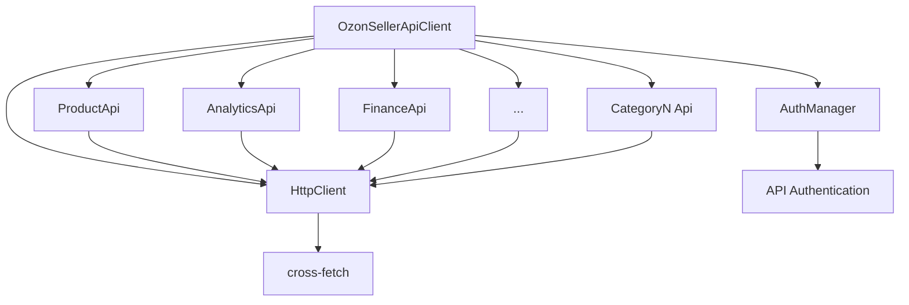

# Component Architecture

## New Components

### AnalyticsApi
**Responsibility:** Business analytics and reporting operations from OZON Analytics API
**Integration Points:** Uses shared HttpClient, follows same constructor pattern as ProductApi

**Key Interfaces:**
- `getReports(request, options?)` - Generate business reports
- `getMetrics(request, options?)` - Retrieve performance metrics

**Dependencies:**
- **Existing Components:** HttpClient (shared service)
- **New Components:** None - standalone category

**Technology Stack:** TypeScript, Zod validation, same patterns as ProductApi

### FinanceApi
**Responsibility:** Financial transactions and reporting operations from OZON Finance API
**Integration Points:** Identical HttpClient integration, consistent error handling

**Key Interfaces:**
- `getTransactions(request, options?)` - Retrieve transaction history
- `getBalance(request, options?)` - Check account balance

**Dependencies:**
- **Existing Components:** HttpClient (shared service)  
- **New Components:** May reference Analytics for financial reports

**Technology Stack:** TypeScript, Zod validation, consistent with existing patterns

### Remaining Categories (3-32)
Each following the established ProductApi pattern:
- Constructor receives HttpClient dependency injection
- Public async methods for each API endpoint
- Consistent TypeScript typing with request/response interfaces
- Optional RequestOptions parameter for all methods
- JSDoc documentation with Russian endpoint descriptions

## Component Interaction Diagram

