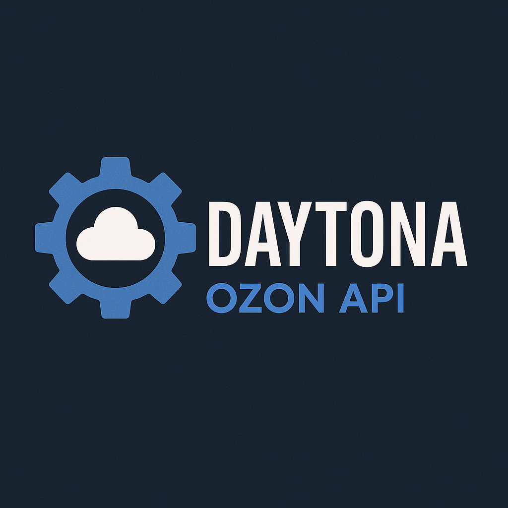

# Документация DAYTONA OZON SELLER API

<div align="center">
  
</div>

Добро пожаловать в бизнес-документацию DAYTONA OZON SELLER API - TypeScript SDK для API продавцов Ozon!

## 📖 Общий обзор

- **[Бизнес-обзор всех модулей](./business-overview.md)** - Полная картина возможностей SDK

## 🚀 Основные модули (P0)

### Управление продажами
- **[FBS API](./modules/fbs-api.md)** - Продажи со склада продавца (22 метода)
- **[FBO API](./modules/fbo-api.md)** - Товары на складах Ozon (13 методов)

### Управление каталогом  
- **[ProductAPI](./modules/product-api.md)** - Карточки товаров (18 методов)
- **[Prices&StocksAPI](./modules/prices-stocks-api.md)** - Цены и остатки (9 методов)

### Аналитика и финансы
- **[AnalyticsAPI](./modules/analytics-api.md)** - Бизнес-аналитика (5 методов)
- **[FinanceAPI](./modules/finance-api.md)** - Финансовое управление (11 методов)
- **[ReportAPI](./modules/report-api.md)** - Детальные отчёты (8 методов)

## 🛠️ Операционные модули

### Клиентский сервис
- **[ChatAPI](./modules/chat-api.md)** - Коммуникации с покупателями (8 методов)
- **[CancellationAPI](./modules/cancellation-api.md)** - Управление отменами (7 методов)
- **[ReturnsAPI](./modules/returns-api.md)** - Обработка возвратов (9 методов)

### Маркетинг и промо
- **[PromosAPI](./modules/promos-api.md)** - Акции и скидки (8 методов)

### Справочники и управление
- **[CategoryAPI](./modules/category-api.md)** - Работа с категориями (4 метода)
- **[SupplierAPI](./modules/supplier-api.md)** - Управление поставщиками (4 метода)

## 📦 Логистические модули

### Управление складами и доставкой
- **[WarehouseAPI](./modules/warehouse-api.md)** - Информация о складах (2 метода)

## 📊 Дополнительные модули

### Управление репутацией
- **[SellerRating](./modules/seller-rating.md)** - Рейтинг продавца (2 метода)

### Экспериментальные (Beta)
- **[BetaMethodAPI](./modules/beta-method.md)** - Расширенная аналитика (9 методов) *Beta*

---

## 📈 Статистика покрытия

- **Всего методов:** 263
- **API групп:** 32 (27 продакшн + 5 бета)
- **Покрытие:** 100% всех доступных методов
- **Типов данных:** 1069 полностью типизированных схем

## 🎯 Быстрый старт

```typescript
import { OzonClient } from 'daytona-ozon-api';

const client = new OzonClient({
  clientId: 'your-client-id',
  apiKey: 'your-api-key'
});

// Получить список товаров
const products = await client.product.list();

// Обновить цены
await client.pricesStocks.updatePrices([
  { offer_id: 'SKU-001', price: '1990.00' }
]);

// Получить аналитику продаж
const analytics = await client.analytics.getSalesReport({
  date_from: '2024-01-01',
  date_to: '2024-01-31'
});
```

---

## 💡 Для кого эта документация

**Продакт-менеджеры** - понимание возможностей каждого модуля
**Бизнес-аналитики** - какие данные можно получить
**Руководители** - оценка потенциала автоматизации  
**Технические менеджеры** - планирование интеграций

Документация написана простым языком без технических деталей, фокус на бизнес-ценности каждого модуля.